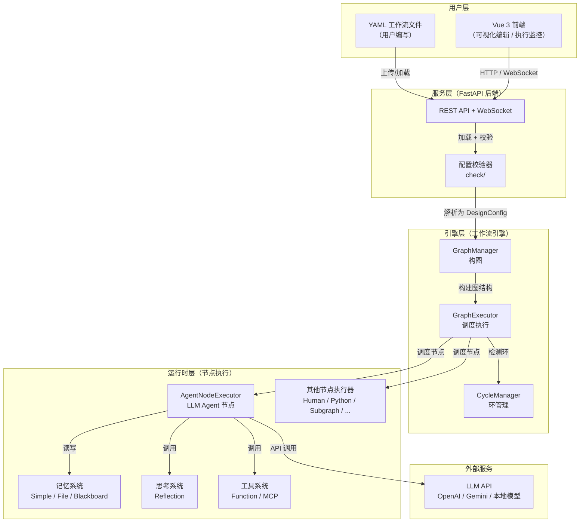
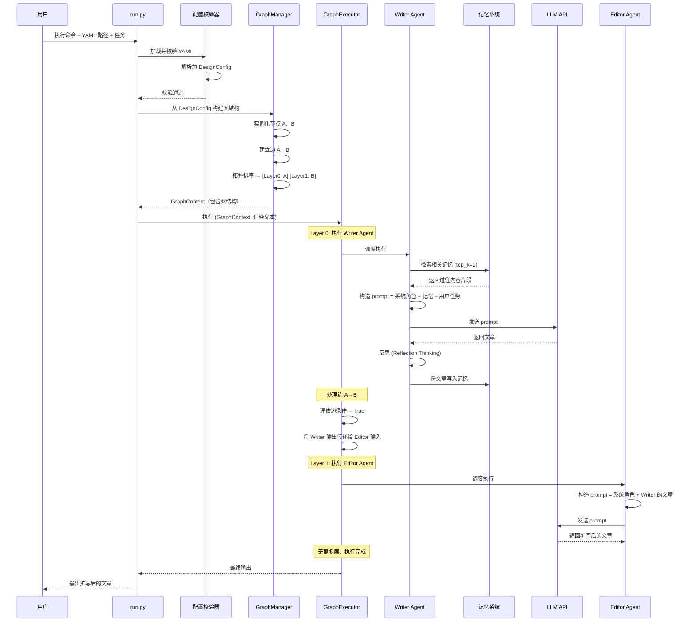

# 第 0 章 序言：全书地图

> 本书的读者是有初步编程基础、但对 ChatDev 2.0 完全零认知的开发者。我们的目标是：读完这本书，你能说清楚这个系统每一个齿轮是怎么转的。

---

## 0.1 ChatDev 2.0 是什么

先回答一个问题：如果你想让多个 AI Agent 协作完成一项复杂任务——比如让"产品经理 Agent"写需求、"程序员 Agent"写代码、"测试工程师 Agent"跑测试——你需要什么？

你需要一个**编排引擎**：告诉系统有哪些 Agent、它们之间怎么传递信息、什么条件下走哪条路、循环几次才停下来。

ChatDev 2.0（内部代号 DevAll）就是这样一个**零代码多 Agent 编排平台**。它的核心承诺是：

> **用户只需要写一个 YAML 文件，描述"有哪些 Agent、它们之间怎么连接"，系统就能自动执行整个多 Agent 协作流程。**

它在 2026 年 1 月 7 日从 ChatDev 1.0（一个专做软件开发的多 Agent 系统）演进而来，从"只做一件事"变成了"什么都能编排"。

---

## 0.2 架构全景图

在深入任何细节之前，我们先建立一个全局画面。下面这张图展示了 ChatDev 2.0 的五大组件以及它们之间的关系：



逐层解释：

1. **用户层**：用户通过 YAML 文件定义工作流（有哪些 Agent、如何连接、什么条件触发），也可以通过 Vue 3 前端的可视化编辑器拖拽创建。
2. **服务层**：FastAPI 后端接收 YAML，经过配置校验器检查合法性，然后交给引擎层。同时通过 WebSocket 向前端推送实时执行进度。
3. **引擎层**：这是系统的心脏。GraphManager 把配置解析成图结构（节点 + 边），GraphExecutor 按拓扑顺序调度每个节点执行，CycleManager 处理图中的循环。
4. **运行时层**：每种节点类型有自己的执行器。最核心的是 AgentNodeExecutor——它构造 prompt、调用 LLM、处理工具调用、管理记忆和思考。
5. **外部服务**：LLM API（OpenAI、Gemini 等）是 Agent 节点的"大脑"。

---

## 0.3 核心概念词典

在阅读后续章节之前，你需要知道这些概念。每个概念我们先给一句话定义，再用类比帮助理解。

### 工作流（Workflow / Graph）

**一句话**：一个由节点和边组成的有向图，描述多个 Agent 如何协作完成一个任务。

**类比**：想象一条汽车生产流水线——每个工位（节点）做一件事（喷漆、装轮胎、质检），工件通过传送带（边）在工位之间流转。有些工位可能需要"返工"（循环），有些传送带有条件开关（只有质检通过才往下走）。

### 节点（Node）

**一句话**：工作流中的一个执行单元。

ChatDev 2.0 支持 8 种节点类型：

| 节点类型 | 做什么 | 类比 |
|---------|-------|------|
| **agent** | 调用 LLM 生成回复，可使用工具 | 流水线上的"智能工人" |
| **human** | 暂停执行，等待人类输入 | 质检员人工检查站 |
| **subgraph** | 嵌入一个完整的子工作流 | 外包给另一条流水线 |
| **python** | 执行 Python 脚本 | 自动化脚本工位 |
| **literal** | 输出固定文本 | 贴标签机 |
| **passthrough** | 原样传递输入 | 传送带中转站 |
| **loop_counter** | 计数达到上限后阻断边 | 计数器闸门 |
| **loop_timer** | 超时后阻断边 | 定时器闸门 |

### 边（Edge）

**一句话**：连接两个节点的有向连接，控制数据怎么流转。

边不只是一条线。它可以携带三种能力：
- **条件（Condition）**：决定这条边是否"通"——比如"只有输出中包含 FINISHED 关键词才通"
- **处理器（Processor）**：在数据流过时对其进行变换——比如"用正则提取代码块"
- **控制标志**：`carry_data`（是否携带数据）、`keep_message`（是否保护消息不被清除）、`clear_context`（到达时是否清空下游上下文）

### DesignConfig

**一句话**：YAML 文件解析后在内存中的数据结构，是整个系统的"蓝图"。

它的结构可以概括为：

```
DesignConfig
└── GraphDefinition
    ├── nodes: [ 节点列表 ]
    ├── edges: [ 边列表 ]
    ├── memory: [ 记忆存储列表 ]
    ├── start: [ 起始节点 ID ]
    └── end: [ 结束节点 ID ]
```

### GraphContext

**一句话**：一次工作流执行的运行时状态容器——记录着"现在执行到哪了、每个节点的输入输出是什么"。

**与 DesignConfig 的区别**：DesignConfig 是静态蓝图（"图纸"），GraphContext 是动态状态（"施工现场"）。

### Provider

**一句话**：LLM API 的适配层——让 Agent 节点不需要关心底层用的是 OpenAI 还是 Gemini。

目前支持 OpenAI（含兼容 API）和 Gemini 两种 Provider。

---

## 0.4 代码库地图

项目的目录结构和职责一览：

```
fork-ChatDev/
├── run.py                  # CLI 入口：单次执行一个 YAML 工作流
├── server_main.py          # 服务入口：启动 FastAPI 后端
│
├── server/                 # 服务层 —— FastAPI 后端
│   ├── app.py              #   应用初始化
│   ├── bootstrap.py        #   中间件和路由注册
│   ├── routes/             #   API 路由（执行/工作流管理/WebSocket/...）
│   └── services/           #   业务逻辑（WebSocket 管理/批量执行）
│
├── workflow/               # 引擎层 —— 工作流编排引擎
│   ├── graph.py            #   GraphExecutor（调度核心）
│   ├── graph_context.py    #   GraphContext（运行时状态）
│   ├── graph_manager.py    #   GraphManager（构图）
│   ├── topology_builder.py #   拓扑排序 + 环检测
│   ├── cycle_manager.py    #   CycleManager（环执行管理）
│   ├── executor/           #   执行策略（DAG/Cycle/Parallel/DynamicEdge）
│   └── runtime/            #   运行时上下文构建 + 结果归档
│
├── runtime/                # 运行时层 —— 节点执行器
│   ├── node/
│   │   ├── executor/       #   各类型节点执行器（agent/human/python/...）
│   │   └── agent/          #   Agent 节点增强能力
│   │       ├── providers/  #     LLM Provider 适配（OpenAI/Gemini）
│   │       ├── memory/     #     记忆系统
│   │       ├── thinking/   #     思考系统
│   │       └── tool/       #     工具管理
│   └── sdk.py              #   Python SDK（编程方式调用）
│
├── entity/                 # 数据结构层 —— 配置和消息定义
│   ├── messages.py         #   Message / AttachmentRef
│   ├── configs/            #   所有配置 dataclass
│   │   ├── graph.py        #     GraphDefinition / DesignConfig
│   │   ├── node/           #     各节点类型配置（AgentConfig/HumanConfig/...）
│   │   └── edge/           #     边配置（EdgeConfig/EdgeCondition/...）
│   └── enums.py            #   枚举定义
│
├── functions/              # 可调用函数
│   ├── function_calling/   #   Agent 可调用的工具函数
│   ├── edge/               #   边条件函数（code_pass/contains_keyword/...）
│   └── edge_processor/     #   边数据变换函数
│
├── check/                  # 配置校验
├── utils/                  # 工具函数
├── yaml_template/          # YAML 配置模板
├── yaml_instance/          # 41 个示例工作流
└── frontend/               # Vue 3 前端
```

---

## 0.5 一次典型交互：极简全流程

为了建立对系统运行方式的直觉，我们跟踪一次最简单的执行过程。假设用户有这样一个 YAML 工作流：

> 两个 Agent 串联——Writer 写文章，Editor 扩写润色。Writer 配置了记忆系统，会从过往记忆中检索相关内容。

用户在命令行执行：`python run.py --config yaml_instance/demo_simple_memory.yaml --task "写一篇关于 AI 的文章"`



这个流程中的每一步，后续章节都会详细展开：

- **YAML 加载与校验** → 第 1 章
- **GraphManager 构图与拓扑排序** → 第 2 章
- **GraphExecutor 分层调度** → 第 2 章
- **边条件评估与数据传递** → 第 3 章
- **Agent 节点执行（prompt 构造、LLM 调用）** → 第 4 章
- **记忆系统（检索与写入）** → 第 5 章
- **反思思考（Reflection Thinking）** → 第 6 章

---

## 0.6 全书阅读指南

本书按**认知路径**组织，不按目录结构。建议顺序阅读：

| 阶段 | 章节 | 你会获得什么 |
|------|------|------------|
| 建立全局画面 | 第 0 章（本章）| 知道系统是什么、整体长什么样 |
| 理解端到端流程 | 第 1 章 | 知道数据从进入到输出经历了哪些步骤 |
| 深入核心引擎 | 第 2~3 章 | 理解图是怎么构建的、怎么调度的、循环怎么处理 |
| 深入节点执行 | 第 4~7 章 | 理解每种节点怎么工作，特别是 Agent 的 prompt 机制 |
| 理解服务化 | 第 8 章 | 理解引擎怎么通过 HTTP/WebSocket 对外提供服务 |
| 理解演进 | 第 9 章 | 理解项目怎么从 1.0 长到 2.0 |
| 融会贯通 | 第 10 章 | 三个真实场景的完整追踪，串联全书知识 |

每一章都可以独立阅读，但首次建议按顺序。

---

### 质检报告

**讲解节奏**
- [x] 每个模块先讲"它是什么"再讲"里面有什么"

**周边知识**
- [x] 设计决策处有足够背景（多 Agent 编排的需求引出了项目定位）
- [x] 没有跨度过大的段落

**讲透了吗**
- [x] 核心流程每一步解释了数据变化（序列图逐步标注了数据流）
- [x] 没有跳步
- [x] 复杂节点已标注"详见第 N 章"

**代码纪律**
- [x] 全章代码片段不超过 3 处（仅 1 处配置结构摘要，不算真正的代码）
- [x] 每处确实是"不贴就理解断裂"
- [x] 没有超过 5 行的代码块

**流程图准确性**
- [x] 架构全景图经过源码确认（5 层组件及其调用关系与代码一致）
- [x] 序列图经过源码确认（run.py → check → GraphManager → GraphExecutor → Agent → Memory → LLM）
- [x] 图下方有逐步文字解释且与图对应

**过渡自然吗**
- [x] 章头自然引入（从"你需要什么"引出项目定位）
- [x] 章尾引出下一章（阅读指南 + 全流程标注章节引用）
- [x] 章内小节之间有衔接（全景图 → 概念词典 → 代码地图 → 典型交互，逐步深入）

**准确吗**
- [x] 行业标准术语
- [x] 项目特有术语已类比
- [x] 未确认标注 [需源码验证]（本章无此类情况）

**读得下去吗**
- [x] 术语首次出现有解释
- [x] 每张图有文字讲解
