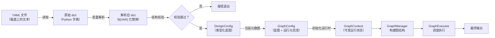
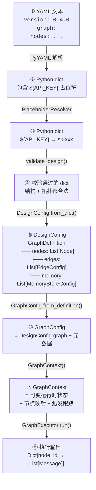
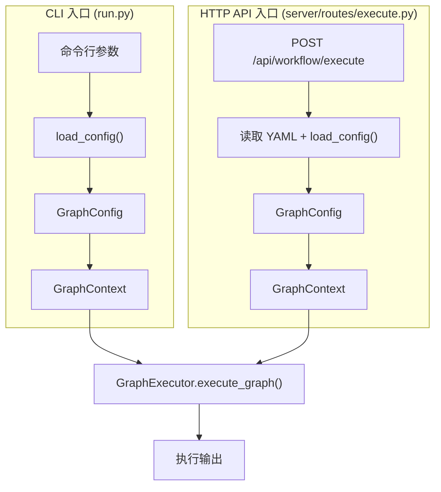

# 第 1 章 从 YAML 到运行：数据流全景

> 上一章我们建立了全局画面——知道了 ChatDev 2.0 是一个 YAML 驱动的多 Agent 编排平台。但"YAML 文件写好之后，系统内部到底发生了什么？"这个问题还是一个黑盒。本章的任务就是把这个黑盒打开，从头到尾追踪一个 YAML 工作流文件被加载、校验、解析、构图、调度、执行、直到输出结果的完整数据流。

每个复杂节点我们暂时当作黑盒，只关注"进去什么、出来什么"。后续章节会逐个打开。

---

## 1.1 数据流全景图

先看全貌，再逐段拆解。



数据经历了 **7 次形态变化**：

| 阶段 | 数据形态 | 关键操作 |
|------|---------|---------|
| ① | YAML 文本 | 从磁盘读取 |
| ② | Python 原始字典 | YAML 解析 |
| ③ | 解析后字典 | `${VAR}` 占位符替换为实际值 |
| ④ | DesignConfig | 类型化解析（dict → dataclass 树） |
| ⑤ | GraphConfig | 包装项目名、输出路径等元数据 |
| ⑥ | GraphContext | 初始化可变运行时状态（节点输入输出、触发状态等） |
| ⑦ | 执行输出 | 图调度完成后的最终结果 |

下面按数据流动的顺序逐段拆解。

---

## 1.2 入口：从命令行到 load_config

一切从 `run.py` 的 `main()` 函数开始。用户在命令行输入：

```bash
python run.py --config yaml_instance/demo_simple_memory.yaml --task "写一篇关于 AI 的文章"
```

调用路径：

```
run.py::main()
  — 解析命令行参数：获取 YAML 路径、任务文本、附件路径
  — 调用 load_config(args.path)
→ check/check.py::load_config()
  — 这是数据流的关键枢纽，串联了接下来的 5 个步骤
  — 输出：DesignConfig 对象
```

`load_config()` 是整个数据加载链的总控函数。它内部按顺序完成：读取 → 变量解析 → 结构校验 → 逻辑校验 → 类型解析。我们逐步看。

---

## 1.3 第一步：YAML 读取与变量解析

### 读取 YAML

```
check/check.py::load_config()
  — 调用 read_yaml(config_path)
  — 输入：文件路径字符串
  — 输出：Python 字典（原始 YAML 内容）
```

这一步很直接——用 PyYAML 把文本变成 Python 字典。例如 YAML 中的：

```yaml
nodes:
  - id: A
    type: agent
    config:
      api_key: ${API_KEY}
```

变成了：

```python
{"nodes": [{"id": "A", "type": "agent", "config": {"api_key": "${API_KEY}"}}]}
```

注意 `${API_KEY}` 此时还只是一个字符串字面量。

### 变量解析

```
check/check.py::load_config()
→ entity/config_loader.py::prepare_design_mapping()
  — 调用 load_dotenv_file()：加载 .env 文件中的环境变量
  — 调用 build_env_var_map()：构建变量查找表
  — 调用 resolve_design_placeholders()：递归替换所有 ${VAR}
  — 输入：包含占位符的字典
  — 输出：所有占位符已替换为实际值的字典
```

变量解析器（`PlaceholderResolver`）的查找优先级：

1. 先查 YAML 文件自身 `vars` 段中定义的变量（支持变量间引用，有循环检测）
2. 再查系统环境变量
3. 都找不到则报错

解析后，`${API_KEY}` 被替换为 `.env` 文件中的实际密钥值。

这个设计解决了一个实际问题：用户不想在 YAML 中硬编码 API 密钥，同时又希望 YAML 可以自包含一些派生变量。

---

## 1.4 第二步：双重校验

变量解析完成后，数据还是一个普通的 Python 字典。在把它转换成类型化对象之前，系统做两轮校验，尽早发现错误。

### 结构校验

```
check/check.py::load_config()
→ check/check_yaml.py::validate_design()
  — 尝试用 DesignConfig.from_dict() 解析
  — 检查所有必填字段是否存在、类型是否正确、枚举值是否合法
  — 输入：解析后的字典
  — 输出：错误列表（空列表表示通过）
```

结构校验回答的是："这个 YAML 的格式对不对？"——比如节点是否有 `id` 和 `type` 字段、`type` 是否是合法的节点类型、Agent 配置是否包含必要的 `provider` 字段等。

### 逻辑校验

```
check/check.py::load_config()
→ check/check_workflow.py::check_workflow_structure()
  — 检查图的拓扑合理性
  — 计算每个节点的入度和出度
  — 验证 end 节点是否引用了存在的节点 ID
  — 确保图有唯一的自然汇（natural sink）或显式指定了 end 节点
  — 递归检查所有嵌套的子图
  — 输入：解析后的字典
  — 输出：错误列表
```

逻辑校验回答的是："这个工作流的拓扑结构合理吗？"——比如是否存在孤立节点、是否有明确的终止条件等。

两轮校验都通过后，`load_config()` 才会正式将字典解析为 `DesignConfig`。

---

## 1.5 第三步：从字典到类型化对象

```
check/check.py::load_config()
→ entity/configs/graph.py::DesignConfig.from_dict()
  — 递归解析整个配置树
  — 输入：校验通过的字典
  — 输出：DesignConfig 对象（包含 GraphDefinition、版本号、全局变量）
```

这一步是从"无类型的字典"到"有类型保证的数据结构"的关键转换。解析过程是递归的：

```
DesignConfig.from_dict(data)
  ├── version: str
  ├── vars: Dict[str, Any]
  └── graph: GraphDefinition.from_dict(data["graph"])
        ├── nodes: [Node.from_dict(n) for n in data["nodes"]]
        │     └── config: AgentConfig / HumanConfig / ... （按 type 字段分派）
        ├── edges: [EdgeConfig.from_dict(e) for e in data["edges"]]
        │     ├── condition: EdgeConditionConfig
        │     └── process: EdgeProcessorConfig
        ├── memory: [MemoryStoreConfig.from_dict(m) for m in data["memory"]]
        ├── start: List[str]
        └── end: List[str]
```

经过这一步，每一层嵌套都有了明确的类型。比如一个 Agent 节点的 `config` 不再是一个无类型的字典，而是一个 `AgentConfig` 对象，有 `provider`、`name`、`role`、`params` 等类型化字段。

---

## 1.6 第四步：包装为 GraphConfig

```
run.py::main()
→ entity/graph_config.py::GraphConfig.from_definition()
  — 输入：GraphDefinition（DesignConfig.graph） + 项目名、输出路径等
  — 输出：GraphConfig 对象
```

`DesignConfig` 是"纯蓝图"——只包含 YAML 里写的信息。但执行一个工作流还需要额外的元信息：

- **项目名称**（用于命名输出目录）
- **输出根路径**（默认 `WareHouse/`）
- **日志级别**
- **YAML 源文件路径**
- **全局变量**

`GraphConfig` 把这些元信息和 `GraphDefinition` 打包在一起，形成"可执行的蓝图"。

---

## 1.7 第五步：初始化运行时状态

```
run.py::main()
→ workflow/graph_context.py::GraphContext.__init__()
  — 输入：GraphConfig
  — 输出：GraphContext 对象（可变运行时状态）
```

如果说 `GraphConfig` 是"施工图纸"，那 `GraphContext` 就是"施工现场"。它初始化了所有运行时需要的可变状态：

- 节点映射表（node_id → Node 对象）
- 每个节点的输入队列和输出缓冲
- 触发状态跟踪（哪些节点被触发了）
- 输出目录创建（`WareHouse/项目名_时间戳/`）
- 子图上下文（如果有嵌套子图）

---

## 1.8 第六步：构建任务输入

```
run.py::main()
→ utils/task_input.py::TaskInputBuilder.build_from_file_paths()
  — 输入：任务文本 + 附件文件路径列表
  — 输出：List[Message]（标准化的消息列表）
```

用户的任务文本和附件需要被包装成系统内部统一的 `Message` 格式。如果有附件（比如 CSV 文件、图片），它们会被注册到 `AttachmentStore` 并转换为 `MessageBlock`：

```
任务输入的数据结构：
  List[Message]
    └── Message
          ├── role: USER
          ├── content: [TextBlock("写一篇关于 AI 的文章"), ImageBlock(...), ...]
          └── metadata: {"source": "TASK"}
```

没有附件时，任务输入就是一个纯文本字符串。

---

## 1.9 第七步：执行

```
run.py::main()
→ workflow/graph.py::GraphExecutor.execute_graph()
  — 输入：GraphContext + 任务输入
  — 内部步骤（每一步详见后续章节）：
    1. 构建图结构（GraphManager）              → 详见第 2 章
    2. 准备边条件和处理器                       → 详见第 3 章
    3. 初始化记忆和思考系统                      → 详见第 5、6 章
    4. 选择执行策略（DAG / Cycle / 多数投票）     → 详见第 2、3 章
    5. 按策略执行所有节点                        → 详见第 4、7 章
    6. 收集输出、保存记忆、归档结果
  — 输出：Dict[str, Any]（各节点的输出）
```

`GraphExecutor.execute_graph()` 是一个静态方法，它内部创建 `GraphExecutor` 实例，然后调用 `_execute()` 方法，`_execute()` 再调用 `run()` 方法。执行完成后，通过 `GraphContext` 获取最终输出。

---

## 1.10 数据形态变化总结

我们用一张表回顾整个数据流中，"数据长什么样"在每一步的变化：



每一次形态变化都不是多余的——它们分别完成了：文本解析、变量注入、合法性验证、类型化、元数据包装、运行时初始化、实际执行。

---

## 1.11 两种执行入口

上面我们追踪的是 CLI 入口（`run.py`）。实际上系统还有另一种入口——通过 HTTP API 执行，这是生产环境中的主要使用方式。

两种入口在"数据流的前半段"有所不同，但在进入 `GraphExecutor` 之后完全一致：



HTTP API 入口的区别在于：
- 任务文本通过 HTTP 请求体传入（而非命令行参数）
- 附件通过上传接口预先存储
- 执行过程中通过 WebSocket 向前端推送实时进度
- 支持 SSE（Server-Sent Events）流式返回结果

但核心数据流——从 `GraphContext` 到 `GraphExecutor` 到最终输出——是完全相同的。服务层的细节将在第 8 章展开。

---

到这里，我们已经走完了一个 YAML 工作流文件从磁盘到最终输出的完整数据流。你现在知道了数据在每一步"长什么样"以及"经历了什么变化"。但有几个关键环节我们还只是标注了"详见第 N 章"——特别是 `GraphManager` 如何构建图结构、`GraphExecutor` 如何调度节点执行。这正是下一章要解答的问题。

---

### 质检报告

**讲解节奏**
- [x] 每个模块先讲"它是什么"再讲"里面有什么"

**周边知识**
- [x] 设计决策处有足够背景（变量解析的优先级设计、双重校验的意义）
- [x] 没有跨度过大的段落

**讲透了吗**
- [x] 核心流程每一步解释了数据变化（7 次形态变化每步都有具体数据结构描述）
- [x] 没有跳步
- [x] 复杂节点已标注"详见第 N 章"（GraphManager → 第 2 章、边条件 → 第 3 章等）

**代码纪律**
- [x] 全章代码片段不超过 3 处（0 处代码片段，全部用调用路径 + 结构描述）
- [x] 每处确实是"不贴就理解断裂"
- [x] 没有超过 5 行的代码块

**流程图准确性**
- [x] 数据流全景图经过源码确认（7 步形态变化对应实际代码路径）
- [x] 双入口对比图经过源码确认（CLI 和 HTTP API 共享 GraphExecutor）
- [x] 图下方有逐步文字解释且与图对应

**过渡自然吗**
- [x] 章头衔接上一章（"上一章建立了全局画面"）
- [x] 章尾引出下一章（"GraphManager 如何构建图结构是下一章的问题"）
- [x] 章内小节之间有衔接（按数据流动顺序自然过渡）

**准确吗**
- [x] 行业标准术语
- [x] 项目特有术语已在上一章类比，本章直接使用
- [x] 未确认标注 [需源码验证]（本章所有细节已验证）

**读得下去吗**
- [x] 术语首次出现有解释
- [x] 每张图有文字讲解
