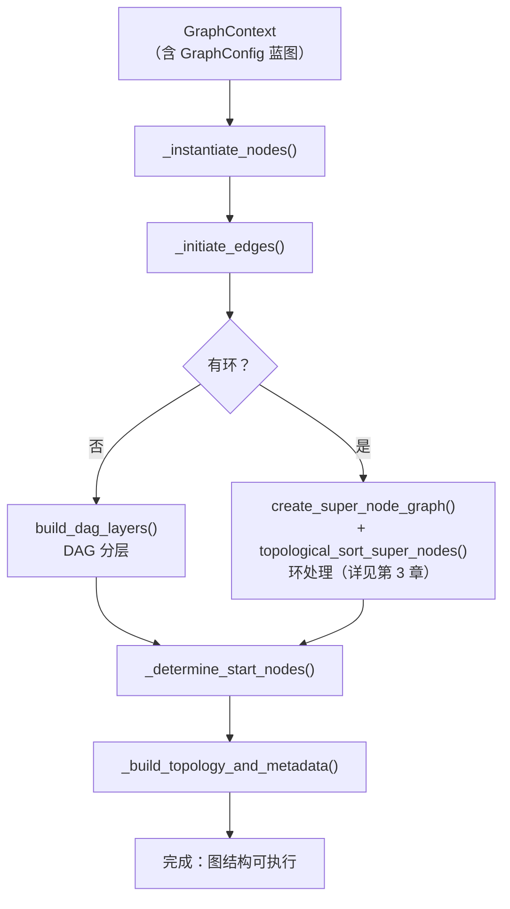
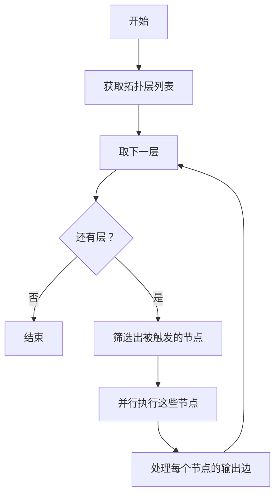

# 第 2 章 图引擎核心：构建与调度

> 上一章我们追踪了数据从 YAML 到最终输出的完整流程，其中有两个关键黑盒被跳过了：GraphManager 如何把配置变成可执行的图结构？GraphExecutor 如何按正确的顺序调度节点？本章就来打开这两个黑盒。

---

## 2.1 图引擎要解决什么问题

在我们的场景中，用户用 YAML 描述了"有哪些节点、它们之间怎么连接"。系统需要把这个描述变成实际可以执行的结构，并且按照正确的顺序执行每个节点。

这里有三个核心挑战：

1. **构建**：把配置中的节点和边实例化为内存中的对象，建立引用关系
2. **排序**：确定节点的执行顺序——上游节点必须在下游节点之前执行
3. **并行**：同一层的独立节点应该并行执行，提升效率

ChatDev 2.0 的做法是：用 **GraphManager** 负责构建，用 **拓扑排序** 确定执行层次，用 **GraphExecutor** 按层调度执行。如果图中存在循环（比如"代码不通过就返回修改"），则需要额外的环处理机制——这是第 3 章的内容。

---

## 2.2 GraphManager：从配置到图结构

GraphManager 是"建筑师"——它拿到 GraphContext（里面有 GraphConfig 蓝图），把它变成一个真正的图结构。



让我们逐步拆解。

### 第一步：实例化节点

```
workflow/graph_manager.py::_instantiate_nodes()
  — 遍历配置中的每个节点定义
  — 深拷贝节点对象（避免修改原始配置）
  — 初始化节点的前驱/后继列表为空
  — 将图级全局变量复制到每个节点
  — 如果节点是 subgraph 类型 → 调用 _build_subgraph() 递归构建子图
  — 输出：graph.nodes 字典（node_id → Node 对象）
```

每个 Node 对象在此阶段获得了自己的身份（id、type）和配置（config），但还不知道自己和谁相连。

### 第二步：建立边连接

```
workflow/graph_manager.py::_initiate_edges()
  — 如果是多数投票模式 → 特殊处理：所有节点放入一层，不建立边
  — 否则，遍历配置中的每个边：
    — 提取条件配置（默认 "true"）
    — 提取处理器配置（可选）
    — 提取动态边配置（可选的 Map/Tree 模式）
    — 在源节点的后继列表中添加边链接
    — 在目标节点的前驱列表中添加边链接
    — 将边存入 graph.edges[] 附带元数据
  — 调用 CycleDetector 检测是否存在环
  — 输出：节点之间已建立引用关系
```

经过这一步，每个节点知道了"谁是我的上游、谁是我的下游"。

### 第三步：拓扑排序（DAG 场景）

如果图中没有环（这是最常见的情况），GraphManager 会对节点做**拓扑排序**（Topological Sort），把节点分成若干"层"。

这里需要补充一点背景知识。**拓扑排序**是图论中的一个经典算法，解决的问题是：给定一个有向无环图，找出一种节点排列顺序，使得所有边都"从前往后"指。直觉上就是"先做前置任务，再做后续任务"。

ChatDev 2.0 使用的是 **Kahn 算法**（基于入度的 BFS 拓扑排序），它天然能把节点分层——入度为 0 的节点是第一层，去掉第一层后新的入度为 0 的节点是第二层，依此类推。

```
workflow/topology_builder.py::GraphTopologyBuilder.build_dag_layers()
  — 计算所有节点的入度
  — 入度为 0 的节点组成 Layer 0（"前沿"）
  — 移除 Layer 0 的节点后，更新入度
  — 新的入度为 0 的节点组成 Layer 1
  — 重复直到所有节点都被分配到某一层
  — 输出：List[List[Dict]]，每层包含该层的节点列表
```

例如，对于下面这个图：

```
A → C
B → C
C → D
```

拓扑排序的结果是：
- Layer 0: [A, B]（入度为 0，可并行执行）
- Layer 1: [C]（依赖 A 和 B，必须等它们完成）
- Layer 2: [D]（依赖 C）

### 第四步：确定起始节点

```
workflow/graph_manager.py::_determine_start_nodes()
  — 验证配置中显式指定的 start 节点是否存在
  — 如果有环，检查环内是否指定了起始节点
  — 输出：graph.start_nodes 列表
```

### 第五步：构建拓扑元数据

```
workflow/graph_manager.py::_build_topology_and_metadata()
  — 将分层结果展平为拓扑列表
  — 计算图的深度（层数）
  — 构建元数据目录（节点类型统计、使用的工具、记忆存储等）
  — 输出：graph 对象上附加了拓扑和元数据信息
```

至此，GraphManager 的工作完成。GraphContext 中现在有了一个完整的图结构：节点已实例化、边已连接、拓扑层次已确定。

---

## 2.3 GraphExecutor：调度执行

GraphExecutor 是"总调度"——它拿到已构建好的图结构，按层依次执行节点。

### 初始化

在开始执行之前，GraphExecutor 需要做一系列准备工作：

```
workflow/graph.py::GraphExecutor.__init__()
  — 接收 GraphContext 和 session_id
  — RuntimeBuilder(graph).build() → RuntimeContext
    — 初始化 ToolManager（管理节点可调用的工具）
    — 初始化 FunctionManager（管理边条件函数）
    — 初始化 LogManager + WorkflowLogger（执行日志）
    — 初始化 TokenTracker（LLM token 用量跟踪）
    — 初始化 AttachmentStore（附件存储）
    — 初始化 CodeWorkspace（节点执行目录）
  — 初始化 ResourceManager（资源/配额管理，基于信号量）
  — 创建取消事件（cancel_event，支持中途取消执行）
```

`RuntimeContext` 是一个"工具箱"——它把所有节点执行过程中可能需要的服务（日志、工具、附件存储等）打包在一起，传递给每个节点执行器。

### 执行主流程

```
workflow/graph.py::GraphExecutor.run()
  — 验证图已构建
  — 调用 _build_memories_and_thinking()：初始化记忆和思考系统 → 详见第 5、6 章
  — 将任务输入规范化为 List[Message]
  — 初始化起始节点：设置触发状态、注入初始消息
  — 选择执行策略：
    — 如果是多数投票模式 → MajorityVoteStrategy
    — 如果有环 → CycleExecutionStrategy           → 详见第 3 章
    — 否则 → DagExecutionStrategy（最常见）
  — 执行策略的 run() 方法
  — 收集所有节点的输出
  — 保存记忆状态到磁盘
  — 归档执行结果
  — 输出：self.outputs（Dict[node_id → 输出消息]）
```

### DAG 执行策略

对于最常见的无环图，`DagExecutionStrategy` 的执行逻辑非常清晰：



```
workflow/executor/dag_executor.py::DAGExecutor.execute()
  — 遍历拓扑层列表
  — 对每一层：
    — 筛选出 is_triggered() 为 True 的节点
    — 调用 ParallelExecutor 并行执行这些节点
    — 跳过未被触发的节点（记录日志）
```

**并行执行的实现**：

```
workflow/executor/parallel_executor.py::ParallelExecutor.execute_items_parallel()
  — 将节点分为两组：阻塞型（blocking）和可并行型
  — 可并行节点：用 ThreadPoolExecutor 并发执行
  — 阻塞型节点：顺序执行
  — 任一节点执行失败则抛出异常
```

阻塞型节点（如 `human` 类型，需要等待人类输入）不会占用线程池中的线程，而是顺序执行。这是一个务实的设计——人类输入节点会阻塞等待，如果放入线程池会浪费线程资源。

### 单节点执行

无论是哪种执行策略，最终都会调用到 `_execute_node()` 来执行单个节点：

```
workflow/graph.py::GraphExecutor._execute_node()
  — 1. 通过 ResourceManager 获取资源锁（信号量）
  — 2. 获取节点的输入消息列表
  — 3. 重置节点的触发状态
  — 4. 检查是否有动态边配置（Map/Tree 模式） → 详见第 3 章
  — 5. 调用节点执行器执行
    — 获取对应类型的执行器（AgentNodeExecutor / PythonNodeExecutor / ...）
    — 执行前钩子（hook.before_node）
    — 执行器.execute(node, input_payload)
    — 执行后钩子（hook.after_node）
  — 6. 将输出消息添加到节点输出缓冲
  — 7. 处理上下文窗口（context_window 限制历史消息数量）
  — 8. 遍历所有出边，处理输出传递
    — 对每条出边调用 _process_edge_output()
```

### 边的输出处理

节点执行完毕后，其输出需要沿着出边传递给下游节点。这个过程不是简单的"复制过去"——它涉及条件判断和数据变换：

```
workflow/graph.py::_process_edge_output()
  — 获取边的 condition_manager
  — 评估条件（输出是否满足这条边的触发条件）
  — 如果条件通过：
    — 标记边为 triggered
    — 如果有 payload_processor → 对数据做变换
    — 根据 carry_data 标志决定是否携带数据
    — 根据 clear_context 标志决定是否清空下游上下文
    — 根据 keep_message 标志标记消息为受保护
    — 将消息添加到目标节点的输入队列
    — 标记目标节点为"已触发"
  — 如果条件不通过：
    — 边保持未触发状态
    — 目标节点不会收到此消息
```

边条件和处理器的具体类型及实现将在第 3 章展开。

---

## 2.4 ResourceManager：资源协调

当多个节点并行执行时，可能需要共享有限的资源（比如同一个 LLM API 的并发限制）。ResourceManager 通过信号量（Semaphore）来协调：

```
workflow/executor/resource_manager.py::ResourceManager
  — 每种资源用一个信号量表示，容量为资源限制数
  — guard_node(node) 方法：
    — 查询节点需要哪些资源
    — 按资源名称排序获取（避免死锁）
    — 获取信号量（阻塞等待如果已满）
    — 执行完成后释放所有信号量
```

例如，如果两个 Agent 节点共享同一个 API key，且该 API 有并发限制 1，那么它们即使在同一层也不会真正同时调用 LLM，而是一个等另一个完成。

---

## 2.5 同类项目对比：工作流编排方式

ChatDev 2.0 选择了"YAML 声明式 DAG + 运行时图引擎"的编排方式。这不是唯一的选择——在多 Agent 编排领域，不同项目采用了截然不同的思路。

**问题是同一个**：如何让用户定义多个 Agent 的协作流程，并自动执行？

### ChatDev 2.0 的思路（回顾）

用 YAML 文件声明节点和边，运行时由图引擎解析配置、拓扑排序、按层执行。用户**完全不写代码**，只描述"谁和谁相连、什么条件走哪条路"。

### LangGraph 的思路

LangGraph（LangChain 生态的图编排库）采用的是**代码式状态机**。用户用 Python 代码定义图的节点（函数）和边（状态转换规则），核心概念是"状态"——整个图共享一个 TypedDict 状态对象，每个节点读写状态的不同字段。

```
LangGraph 的模式：
  定义 → Python 代码中构建 StateGraph，add_node() / add_edge() / add_conditional_edges()
  状态管理 → 共享 TypedDict，每个节点函数读写字段
  条件路由 → Python 函数返回下一个节点名
  执行 → 编译为 CompiledGraph 后 invoke()
```

### CrewAI 的思路

CrewAI 采用的是**角色声明式**编排。用户定义 Agent（有角色、目标、背景故事）和 Task（有描述、预期输出、分配给哪个 Agent），然后由 Crew 对象自动编排执行。用户不需要显式定义边——Task 之间的依赖关系由 CrewAI 自动推断或按声明顺序执行。

```
CrewAI 的模式：
  定义 → Python 代码声明 Agent（角色+目标）和 Task（描述+分配）
  编排 → sequential（按顺序）或 hierarchical（经理分派）
  状态管理 → Task 输出自动传给下一个 Task
  执行 → crew.kickoff()
```

### 差异根源

| 维度 | ChatDev 2.0 | LangGraph | CrewAI |
|------|------------|-----------|--------|
| 定义方式 | YAML 声明 | Python 代码 | Python 声明 |
| 目标用户 | 零代码用户 | 开发者 | 开发者（侧重角色扮演） |
| 灵活度 | 中（受限于 YAML 表达力）| 高（任意 Python 逻辑）| 低（固定模式） |
| 学习曲线 | 低（学 YAML 格式即可）| 中（需理解状态机概念）| 低（直觉化角色定义） |
| 可视化 | 天然适配（YAML → 图 → 可视化编辑器）| 需额外工具 | 不支持 |
| 控制粒度 | 边级别（条件、处理器、carry_data 等）| 节点级别（状态函数逻辑）| Task 级别 |

**差异的根源**在于设计哲学不同：

- **ChatDev 2.0** 追求"零代码"——让非开发者也能编排 Agent。这要求配置格式是声明式的，代价是灵活度受限于 YAML 能表达的范围。
- **LangGraph** 追求"最大灵活度"——开发者可以用任意 Python 逻辑控制流程。代价是必须写代码，且状态机模型有一定学习门槛。
- **CrewAI** 追求"开箱即用"——通过角色和任务的高层抽象简化使用，代价是难以实现精细的流程控制。

这三种思路没有优劣之分，适合不同场景。ChatDev 2.0 的选择（YAML + 图引擎）使得它天然适配可视化编辑器——因为 YAML 描述的就是一个图，而图是可以直接画出来的。

---

## 2.6 本章小结

本章我们打开了图引擎的两个核心黑盒：

1. **GraphManager** 完成"从配置到图结构"的构建：实例化节点 → 建立边连接 → 检测环 → 拓扑排序分层
2. **GraphExecutor** 完成"按层调度执行"：初始化运行时 → 选择策略 → 逐层并行执行节点 → 处理边输出传递

但我们留下了两个问题没有回答：图中有循环怎么办？边条件具体是怎么工作的？这两个问题紧密相关——循环的退出条件本身就是一种边条件。下一章我们将一起解决它们。

---

### 质检报告

**讲解节奏**
- [x] 每个模块先讲"它是什么"再讲"里面有什么"

**周边知识**
- [x] 补充了拓扑排序的背景知识（问题、算法、直觉）
- [x] 补充了信号量的用途说明
- [x] 没有跨度过大的段落

**讲透了吗**
- [x] GraphManager 5 个步骤逐一解释了数据变化
- [x] DAG 执行策略的层级执行逻辑清晰
- [x] 单节点执行和边处理的 8 个步骤完整
- [x] 没有跳步
- [x] 环处理、边条件细节、记忆/思考系统标注了"详见第 N 章"

**代码纪律**
- [x] 全章代码片段 0 处（全部用调用路径 + 结构描述 + 流程图）
- [x] 没有超过 5 行的代码块

**同类对比**
- [x] 满足三个前提条件（问题域：多 Agent 编排；输入输出：Agent 定义 → 自动执行；思路差异：YAML 声明 vs 代码状态机 vs 角色声明）
- [x] 在同一层级（架构层面的编排方式）上展开
- [x] 分析了差异根源（设计哲学不同），没有做"哪个更好"的评判

**流程图准确性**
- [x] GraphManager 构建流程图经过源码确认
- [x] DAG 执行策略流程图经过源码确认
- [x] 图下方有逐步文字解释且与图对应

**过渡自然吗**
- [x] 章头衔接上一章（"上一章有两个黑盒被跳过"）
- [x] 章尾引出下一章（"循环和边条件是下一章的问题"）
- [x] 章内小节之间有衔接

**准确吗**
- [x] 行业标准术语（DAG、拓扑排序、信号量、Kahn 算法）
- [x] 项目特有术语已在前序章节类比
- [x] 未确认标注 [需源码验证]

**读得下去吗**
- [x] 术语首次出现有解释
- [x] 每张图有文字讲解
