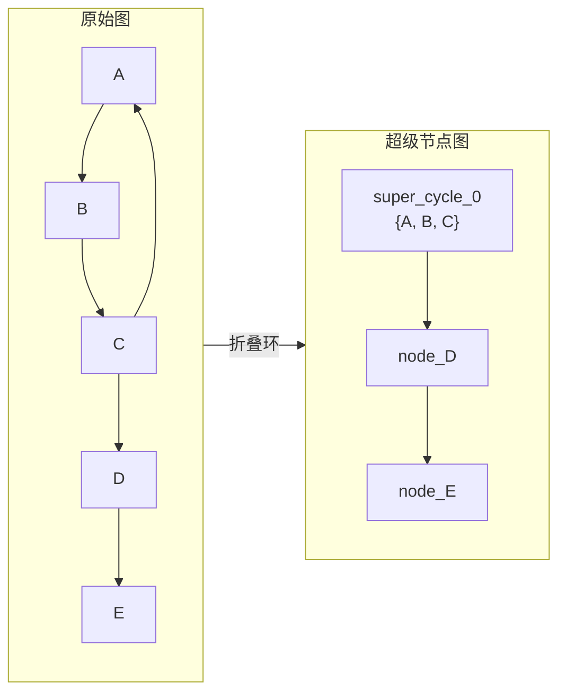
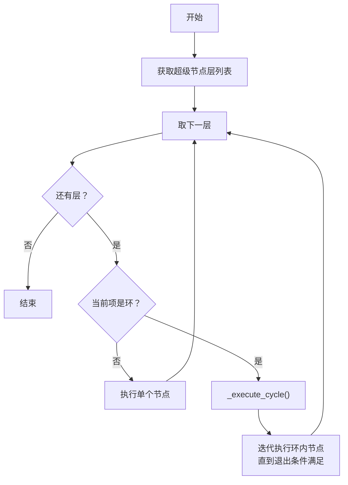
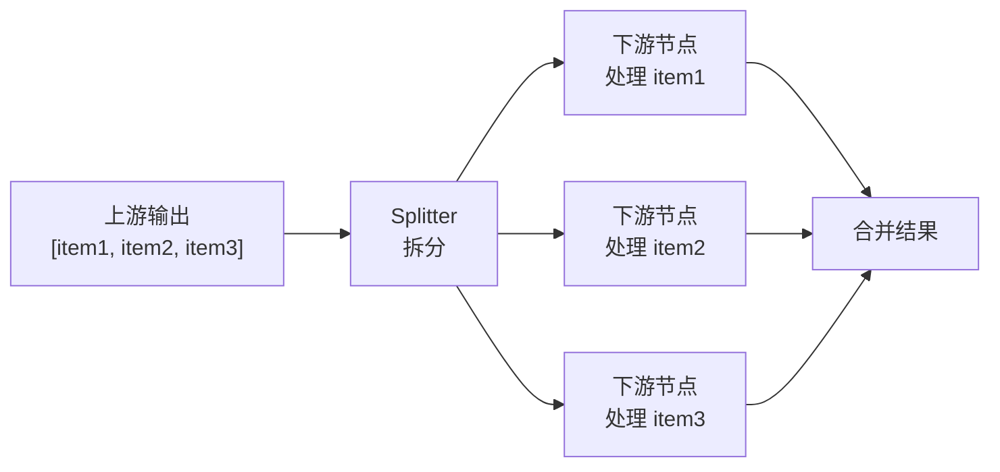
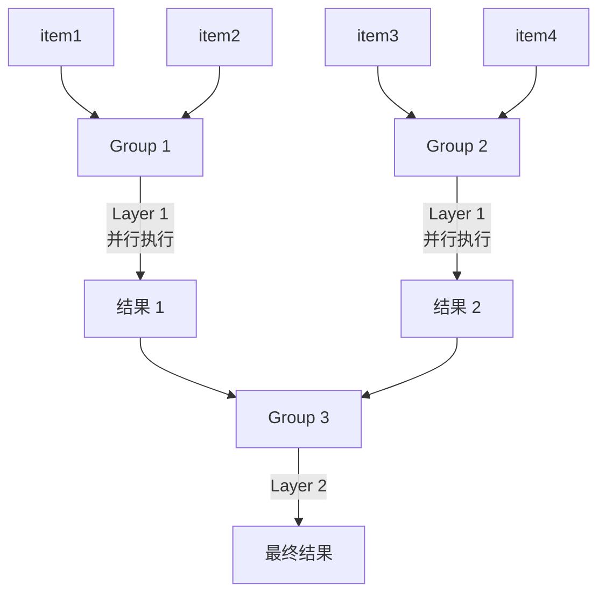

# 第 3 章 循环与分支：环检测与动态边

> 上一章我们理解了 DAG（无环图）场景下的构建和调度。但现实中的工作流经常需要"循环"——比如"程序员写代码 → 测试不通过 → 返回修改 → 再测试"。图中一旦有环，拓扑排序就失效了（拓扑排序的前提是无环）。ChatDev 2.0 是怎么处理这个问题的？同时，边上的条件判断和数据变换具体又是怎么工作的？本章解答这两个问题。

---

## 3.1 环检测：Tarjan 算法

### 为什么需要环检测

当用户在 YAML 中定义了 A→B→C→A 这样的连接关系时，图中就出现了一个环。系统需要：
1. **发现**哪些节点构成了环
2. **特殊处理**这些环——不能简单地按 DAG 分层执行

ChatDev 2.0 使用 **Tarjan 算法**来检测环。Tarjan 算法是图论中检测**强连通分量（Strongly Connected Components, SCC）**的经典算法。一个强连通分量就是"图中互相可达的一组节点"——换句话说，就是一个环（或一组嵌套的环）。

### 算法如何工作

Tarjan 算法的核心思路是：对图做深度优先搜索（DFS），同时维护一个栈和两个计数器。当发现某个节点能"回到"自己的祖先时，就找到了一个环。

```
workflow/cycle_manager.py::CycleDetector._strong_connect()
  — 对每个节点维护两个值：
    — index：DFS 访问顺序
    — low_link：该节点能回溯到的最早祖先的 index
  — 如果一个节点的 low_link == index（回溯不到更早的祖先），
    说明它是某个强连通分量的"根"
  — 从栈中弹出所有节点直到该根 → 这就是一个 SCC
  — 如果 SCC 包含多个节点，或单节点有自环 → 这是一个环
  — 输出：List[Set[node_id]]，每个 Set 是一个环中的节点集合
```

例如，图 A→B→C→A, C→D 中：
- {A, B, C} 构成一个强连通分量（环）
- {D} 是一个单独的节点（不是环）

### CycleInfo：环的元数据

检测到环之后，`CycleManager` 会为每个环构建详细的元数据：

```
workflow/cycle_manager.py::CycleManager.initialize_cycles()
  — 对每个环创建 CycleInfo 对象
  — _analyze_cycle_structure() 分析：
    — entry_nodes：哪些环内节点有来自环外的入边（"入口"）
    — exit_edges：哪些环内节点有通向环外的出边（"出口"）
  — 维护 iteration_count（当前迭代次数）和 max_iterations（上限）
```

CycleInfo 的关键字段：

| 字段 | 含义 |
|------|------|
| cycle_id | 环的唯一标识 |
| nodes | 环中包含的所有节点 ID |
| entry_nodes | 从环外可以进入的节点（入口） |
| exit_edges | 从环内可以通向环外的边（出口） |
| iteration_count | 当前已执行的迭代次数 |
| max_iterations | 最大迭代次数（防止无限循环） |
| is_active | 环是否正在执行中 |

---

## 3.2 超级节点图：让有环图可排序

发现环之后，下一个问题是：怎么对有环的图做"拓扑排序"？

ChatDev 2.0 的解法很巧妙——**把每个环"折叠"成一个超级节点**，形成一个新的无环图（超级节点图），然后对超级节点图做拓扑排序。



```
workflow/topology_builder.py::GraphTopologyBuilder.create_super_node_graph()
  — 每个环 → 一个超级节点 "super_cycle_{i}"
  — 每个非环节点 → 一个超级节点 "node_{node_id}"
  — 建立超级节点之间的依赖关系（基于原始图的边）
  — 输出：Dict[super_node_id → Set[依赖的 super_node_id]]

→ GraphTopologyBuilder.topological_sort_super_nodes()
  — 对超级节点图做 Kahn 算法拓扑排序
  — 输出：List[List[Dict]]，每层包含超级节点列表
    — 每个条目标注 type="node" 或 type="cycle"
```

排序后的执行顺序变成：先执行 super_cycle_0（内部迭代），完成后执行 D，最后执行 E。

---

## 3.3 环的执行策略

### CycleExecutionStrategy

当图中存在环时，GraphExecutor 选择 `CycleExecutionStrategy`：



```
workflow/executor/cycle_executor.py::CycleExecutor.execute()
  — 遍历超级节点层列表
  — 对每一层的每个条目：
    — 如果 type=="node" → 直接执行节点
    — 如果 type=="cycle" → 调用 _execute_cycle()
```

### 环的迭代执行

```
workflow/executor/cycle_executor.py::_execute_cycle()
  — 1. _validate_cycle_entry()：确定环的入口节点
    — 找到从环外被触发的节点
    — 与配置中指定的入口节点做一致性检查
  — 2. 激活环（cycle_manager.activate_cycle）
  — 3. _execute_cycle_with_iterations()：迭代执行
    — WHILE iteration < max_iterations:
      — A. 构建环内的拓扑层（首次迭代时移除入口节点的外部前驱）
      — B. 按层执行环内所有节点
      — C. 检查是否有外部节点被触发（通过出口边）→ 如果是，跳出
      — D. 检查入口节点是否被重新触发 → 如果否，跳出
      — E. 迭代计数 +1
  — 4. 停用环（cycle_manager.deactivate_cycle）
```

环的退出有三种情况：
1. **达到最大迭代次数**——安全阀，防止无限循环
2. **外部节点被触发**——环内某条出口边的条件通过了，数据流出了环
3. **入口节点未被重新触发**——环内的循环条件不再满足

这些退出条件中，最常见的是第 2 种——通过边条件控制退出。比如 ChatDev_v1 工作流中，"代码测试通过"这个条件决定了代码是否需要继续循环修改。

---

## 3.4 边条件系统

边条件是控制数据流向的核心机制。它回答的问题是："上游节点的输出满足什么条件时，数据才沿这条边传递？"

### 条件类型

ChatDev 2.0 支持多种边条件类型：

| 条件类型 | 含义 | 示例 |
|---------|------|------|
| `"true"` | 无条件通过 | 默认值，总是让数据通过 |
| 关键词匹配 | 输出中包含指定关键词时通过 | `condition: "FINISHED"` |
| 函数条件 | 调用一个 Python 函数判断 | `condition: { type: function, name: code_pass }` |
| LLM 条件 | 调用 LLM 来判断 | 用于复杂的语义判断 |

### 内置的条件函数

```
functions/edge/conditions.py 中定义了常用的条件函数：
  — code_pass(data)：检查输出中是否不包含 "==CODE EXECUTION FAILED=="
  — need_reflection_loop(data)：检查是否需要继续反思循环（未出现 STOP/DONE）
  — should_stop_loop(data)：检查是否应该停止循环（出现了 STOP/DONE）
  — contains_keyword(data)：检查是否包含 "trigger" 关键词
  — length_greater_than_5(data)：检查文本长度是否大于 5
```

在 YAML 中的使用方式：

```yaml
edges:
  - from: Programmer
    to: CodeReviewer
    condition: "<INFO> Finished"    # 关键词匹配：输出包含这个词才通过
  - from: Tester
    to: Programmer
    condition:
      type: function
      name: code_fail               # 函数条件：代码执行失败时通过
```

### 条件评估流程

```
workflow/graph.py::_process_edge_output()
→ edge_link.condition_manager.process()
  — 获取上游节点的输出文本
  — 根据条件类型评估：
    — "true" → 直接通过
    — 关键词 → str.find(keyword) 检查
    — 函数 → 调用注册的 Python 函数
    — LLM → 构造 prompt 让 LLM 判断
  — 返回 True/False
```

---

## 3.5 边处理器（Payload Processor）

条件决定"这条边通不通"，处理器决定"通过的数据长什么样"。处理器在数据沿边传递时对其进行变换。

### 内置处理器

```
functions/edge_processor/transformers.py 中的关键处理器：
  — code_save_and_run(data)：
    — 从输出中用正则提取代码块（匹配 FILENAME + ```python ... ``` 模式）
    — 将代码保存到工作目录
    — 执行 main.py（带 3 秒超时）
    — 返回代码内容 + 执行结果（或错误信息）
```

这个处理器在 ChatDev_v1 工作流中非常关键——程序员 Agent 生成的代码需要被提取出来、保存到文件、实际运行、然后把运行结果传给测试工程师 Agent。

### 在 YAML 中的使用

```yaml
edges:
  - from: Programmer
    to: Tester
    process:
      type: function
      name: code_save_and_run       # 提取代码、保存、运行、返回结果
```

---

## 3.6 动态边：Map 和 Tree 模式

普通的边是"一对一"的——一个输出传给一个下游节点。但有些场景需要"一对多"或"多对一"的处理，这就是动态边的用途。

### Map 模式

将上游输出拆分成多个片段，对每个片段**并行**执行下游节点，最后合并结果。



```
workflow/executor/dynamic_edge_executor.py::_execute_map()
  — 用 SplitterFactory 拆分输入（支持 json_path / pattern / line 三种拆分方式）
  — 对每个片段并行调用节点执行器（ThreadPoolExecutor）
  — 每个片段的输出标注 dynamic_edge_unit_index
  — 合并所有输出返回
```

### Tree 模式

将大量输入分组，逐层聚合（类似 MapReduce 的 Reduce 阶段），直到只剩一个输出。



```
workflow/executor/dynamic_edge_executor.py::_execute_tree()
  — 将所有输入按 group_size 分组
  — 每组并行执行节点
  — 每层的输出成为下一层的输入
  — 重复直到只剩一个输出
```

Tree 模式适合处理大量输入需要逐步汇总的场景——比如将 100 个研究文献分组摘要，再将摘要进一步合并。

### 拆分方式

| 拆分类型 | 用途 | 示例 |
|---------|------|------|
| json_path | 从 JSON 输出中提取数组 | `split.json_path: "$.items"` |
| pattern | 用正则表达式拆分 | `split.pattern: "(?:^|\n)Chapter:"` |
| line | 按行拆分 | 每行作为一个独立片段 |

---

## 3.7 边的控制标志

除了条件和处理器，每条边还有三个控制标志，它们精细地控制数据如何传递给下游：

| 标志 | 默认值 | 作用 |
|------|-------|------|
| `carry_data` | true | 是否将上游输出携带给下游。设为 false 时下游收到空上下文 |
| `keep_message` | false | 将消息标记为"受保护"，在 clear_context 时不会被清除 |
| `clear_context` | false | 到达下游时清空其已有上下文（但保留 keep_message 的消息） |

这三个标志的组合可以实现复杂的上下文管理策略。例如在代码开发循环中：
- 从 Programmer 到 Tester 的边设置 `carry_data: true`——测试需要看到代码
- 从 Tester 到 Programmer 的边设置 `clear_context: true`——每轮修改从干净的上下文开始，但 `keep_message: true` 保留原始需求

---

## 3.8 本章小结

本章我们解决了两个核心问题：

1. **图中有环怎么办**：用 Tarjan 算法检测环 → 把环折叠为超级节点 → 对超级节点图做拓扑排序 → 环内迭代执行直到退出条件满足
2. **边条件怎么工作**：支持常量/关键词/函数/LLM 四种条件类型，加上处理器可以变换数据，加上三个控制标志精细管理上下文

至此，我们已经理解了图引擎的完整工作方式——无环图和有环图都能处理。接下来的问题是：图中最核心的节点类型——Agent 节点——它内部是怎么工作的？它如何构造 prompt、调用 LLM、处理工具调用？这是下一章的主题。

---

### 质检报告

**讲解节奏**
- [x] 每个模块先讲"它是什么"再讲"里面有什么"

**周边知识**
- [x] Tarjan 算法的背景知识（强连通分量的概念、算法核心思路）
- [x] 没有跨度过大的段落

**讲透了吗**
- [x] 环检测 → 超级节点 → 迭代执行的完整链路
- [x] 边条件的四种类型和内置函数
- [x] 动态边的 Map/Tree 两种模式
- [x] 边控制标志的组合使用场景
- [x] 没有跳步

**代码纪律**
- [x] 全章代码片段 0 处（全部用调用路径 + 结构描述 + 流程图）
- [x] 没有超过 5 行的代码块

**流程图准确性**
- [x] 超级节点折叠图经过源码确认
- [x] 环执行策略流程图经过源码确认
- [x] Map/Tree 模式图经过源码确认
- [x] 图下方有逐步文字解释且与图对应

**过渡自然吗**
- [x] 章头衔接上一章（"上一章留下了环和边条件的问题"）
- [x] 章尾引出下一章（"Agent 节点内部怎么工作是下一章的主题"）
- [x] 章内小节之间有因果衔接

**准确吗**
- [x] 行业标准术语（Tarjan、SCC、DFS）
- [x] 项目特有术语已在前序章节类比
- [x] 未确认标注 [需源码验证]

**读得下去吗**
- [x] 术语首次出现有解释
- [x] 每张图有文字讲解
