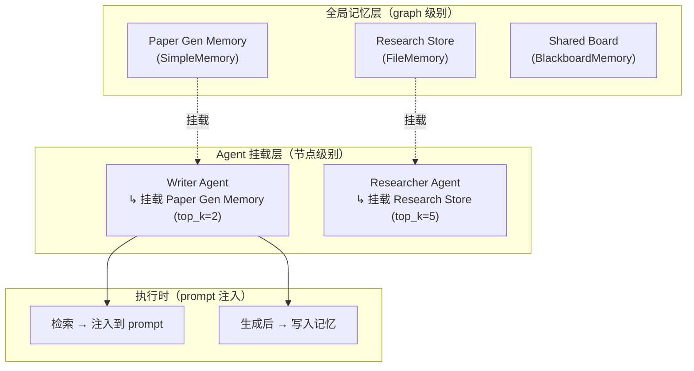
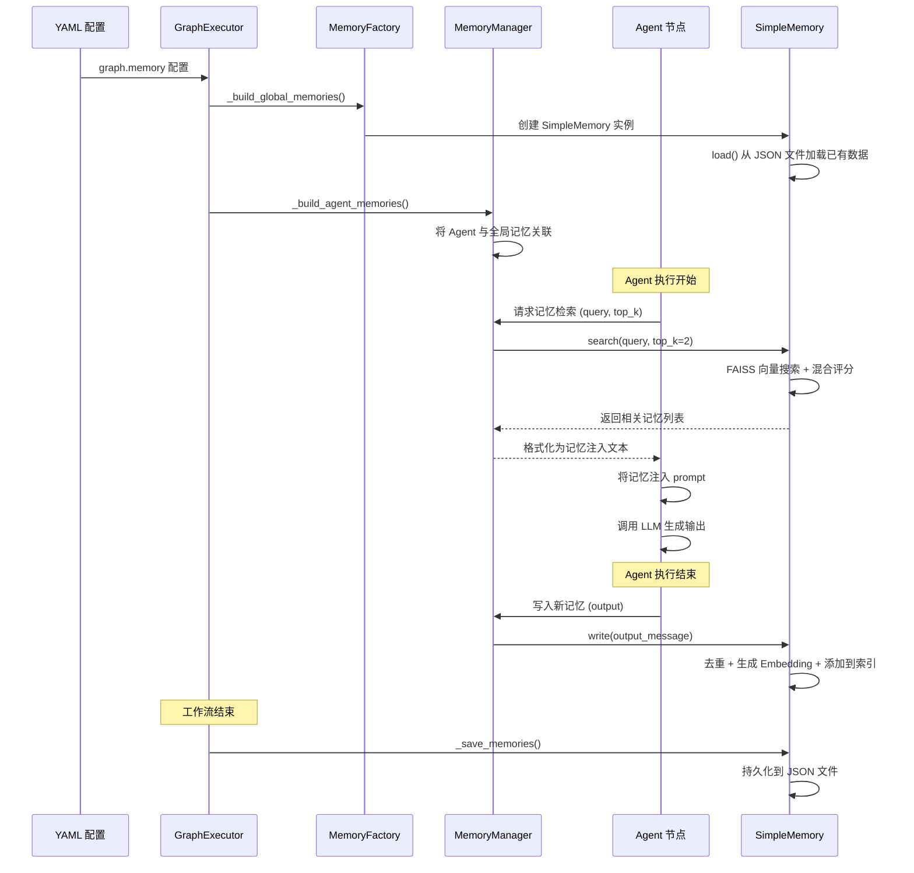

# 第 5 章 记忆系统：让 Agent 拥有长期记忆

> 上一章我们看到 Agent 节点在构造 prompt 时会"注入记忆"——从记忆系统中检索相关内容并融入到发送给 LLM 的消息中。但记忆是怎么存储的？检索时如何找到"相关的"内容？FAISS 向量搜索又是什么？本章将完整拆解 ChatDev 2.0 的记忆系统。

---

## 5.1 记忆系统要解决什么问题

LLM 有一个天然局限：**它没有跨次调用的记忆**。每次调用都是独立的，LLM 不知道上次它生成了什么。这在多 Agent 协作中是一个严重问题——比如 Writer Agent 今天写的文章，下次运行时就"忘了"。

ChatDev 2.0 的记忆系统解决的是：**让 Agent 能在多次执行之间保留和利用过往信息。**

它的设计分为三层：



1. **全局记忆层**：在 YAML 的 `memory` 段定义，是 graph 级别的共享资源
2. **Agent 挂载层**：每个 Agent 节点通过 `memories` 配置挂载一个或多个全局记忆存储
3. **执行层**：Agent 执行时从挂载的记忆中检索，生成后写入

---

## 5.2 三种记忆存储

### SimpleMemory：基于向量的语义记忆

**它是什么**：最常用的记忆类型。每条记忆是一段文本，带有向量嵌入（Embedding），支持语义相似度搜索。数据持久化在 JSON 文件中。

**适用场景**：需要语义检索的场景——"找出和当前任务相关的过往内容"。

**存储结构**：每条记忆包含原始文本、向量嵌入、去重用的指纹。

**检索机制**（这是最核心的部分，值得展开讲）：

```
runtime/node/agent/memory/simple_memory.py 检索流程：
  — 1. 将查询文本生成 Embedding 向量
  — 2. 用 FAISS 做向量相似度搜索（余弦相似度）
  — 3. 计算综合评分 = 0.7 × 向量相似度 + 0.3 × 语义相似度
  — 4. 按综合评分排序，返回 top_k 条结果
```

这里需要补充两个背景知识：

**什么是 Embedding？** Embedding 是将文本转换为一个固定长度的浮点数向量（比如 1536 维）。语义相近的文本，向量之间的距离（余弦距离）也会很小。比如"猫在睡觉"和"小猫打盹"的 Embedding 向量会很接近，而"猫在睡觉"和"股票涨停"则相距很远。

**什么是 FAISS？** FAISS（Facebook AI Similarity Search）是 Meta 开发的向量相似度搜索库。它能在大量向量中快速找到与查询向量最接近的几个。ChatDev 2.0 用它来在记忆库中快速找到与当前任务语义最相关的过往内容。

**为什么用混合评分？** 纯向量相似度有时会"似是而非"——两段文本向量接近但实际内容不那么相关。0.3 权重的"语义相似度"是基于词重叠、最长公共子序列（LCS）、关键词匹配等传统 NLP 指标计算的，作为向量搜索的补充修正。

**写入机制**：

```
runtime/node/agent/memory/simple_memory.py 写入流程：
  — 1. 提取消息的文本内容
  — 2. 计算内容指纹（用于去重）
  — 3. 检查是否已存在相同指纹的记忆 → 如果是，跳过
  — 4. 生成 Embedding 向量
  — 5. 添加到 FAISS 索引 + 内存存储
  — 6. 持久化到 JSON 文件
```

### FileMemory：文件级只读记忆

**它是什么**：将一个或多个文件的内容切成小块（chunk），建立向量索引，供 Agent 检索。**只读**——Agent 不能写入。

**适用场景**：让 Agent 拥有"知识库"——比如项目文档、API 手册。

**分块策略**：默认 500 字符一块，50 字符重叠（确保跨块的信息不丢失）。

### BlackboardMemory：共享黑板记忆

**它是什么**：一个简单的追加式列表。所有挂载它的 Agent 共享同一个列表，按时间顺序写入和读取（最新的在前）。**不使用向量搜索**——按最近插入的顺序返回。

**适用场景**：多个 Agent 之间的"公告板"——比如经理 Agent 在黑板上写指令，执行 Agent 去读。

---

## 5.3 记忆的生命周期



关键时间点：
1. **工作流开始前**：加载已有记忆（从上次执行保存的 JSON 文件）
2. **Agent 执行前**：检索相关记忆，注入到 prompt
3. **Agent 执行后**：将输出写入记忆（带去重）
4. **工作流结束后**：将所有记忆持久化到磁盘

---

## 5.4 记忆检索的配置

在 YAML 中，Agent 节点通过 `memories` 配置挂载记忆：

```yaml
memories:
  - name: Paper Gen Memory    # 挂载哪个全局记忆存储
    top_k: 2                   # 检索最相关的 2 条
    retrieve_stage:
      - gen                     # 在"生成"阶段检索（即调用 LLM 之前）
```

`retrieve_stage` 控制在哪个阶段触发检索——`gen` 表示在生成前检索，让 LLM 能参考过往信息。

---

## 5.5 记忆注入的格式

检索到的记忆被格式化为特定格式后注入 prompt：

```
===== Related Memories =====

--- Paper Gen Memory ---
1. [第一条相关记忆内容]
2. [第二条相关记忆内容]

===== End of Memory =====
```

这个格式是硬编码在 `memory_base.py` 中的。之所以用 `=====` 这样醒目的分隔符，是为了让 LLM 能明确区分"记忆内容"和"用户输入"——避免 LLM 把记忆内容当作用户指令执行。

---

## 5.6 同类项目对比：记忆机制

ChatDev 2.0 的记忆机制有独特之处：全局共享存储 + Agent 级挂载 + 向量检索。其他项目怎么做？

**问题是同一个**：如何让 Agent 在多次交互中保留和利用历史信息？

### ChatDev 2.0 的思路（回顾）

全局定义记忆存储（SimpleMemory / FileMemory / BlackboardMemory），Agent 通过配置挂载。检索用 FAISS 向量搜索 + 混合评分。持久化在 JSON 文件中。记忆是 graph 级资源，多个 Agent 可以共享同一个记忆存储。

### AutoGen 的思路

AutoGen（微软的多 Agent 框架）的记忆机制以**对话缓冲（Chat History）**为主。每个 Agent 维护自己的对话历史列表，多 Agent 之间通过"组聊（Group Chat）"共享对话。没有独立的向量检索层——如果需要长期记忆，需要外挂 RAG 系统。

```
AutoGen 的模式：
  存储 → 对话历史列表（内存中）
  检索 → 按对话顺序回溯（窗口控制）
  共享 → 组聊中的消息自动可见给所有参与 Agent
  持久化 → 需要用户自行实现
```

### LangChain 的思路

LangChain 提供了多种 Memory 类型：ConversationBufferMemory（全量对话）、ConversationSummaryMemory（对话摘要）、VectorStoreRetrieverMemory（向量检索）等。它们以**Chain 的附件**形式存在——每次 Chain 执行前加载记忆变量、执行后保存上下文。

```
LangChain 的模式：
  存储 → 多种可选后端（内存/Redis/向量数据库/...）
  检索 → 按类型不同（缓冲/摘要/向量/...）
  共享 → Memory 绑定到 Chain，不同 Chain 需显式共享
  持久化 → 取决于选择的后端
```

### 差异根源

| 维度 | ChatDev 2.0 | AutoGen | LangChain |
|------|------------|---------|-----------|
| 记忆粒度 | graph 级共享 | Agent 级对话 | Chain 级绑定 |
| 检索方式 | 向量搜索（内置） | 对话回溯 | 多种可选 |
| 共享机制 | 多 Agent 挂载同一存储 | 组聊自动共享 | 需显式传递 |
| 配置方式 | YAML 声明 | Python 代码 | Python 代码 |
| 持久化 | JSON 文件（内置） | 需自行实现 | 取决于后端 |

**差异的根源**在于对"记忆属于谁"的设计哲学不同：

- **ChatDev 2.0** 把记忆视为**graph 级共享资源**——就像工厂里的"知识库"，不同工位（Agent）按需查阅同一个知识库。这种设计天然适合"多 Agent 共享知识"的场景。
- **AutoGen** 把记忆视为**对话历史的自然延伸**——Agent 之间的记忆就是它们之间的对话记录。简单直接，但不支持语义检索。
- **LangChain** 把记忆视为**可插拔的组件**——提供最大灵活度，但需要开发者自行选择和组合。

ChatDev 2.0 的选择（全局共享 + 向量检索 + YAML 配置）与它"零代码编排"的设计哲学一致：用户在 YAML 中声明记忆存储和挂载关系，不需要写代码就能让 Agent 拥有语义记忆。

---

## 5.7 本章小结

记忆系统让 Agent 从"每次都是新人"变成"有经验的老手"。核心机制是：

1. **三种存储类型**：SimpleMemory（向量语义检索）、FileMemory（文件知识库）、BlackboardMemory（共享公告板）
2. **全局共享 + Agent 挂载**：记忆是 graph 级资源，Agent 通过配置按需挂载
3. **FAISS 向量检索 + 混合评分**：0.7 向量相似度 + 0.3 语义相似度
4. **持久化**：JSON 文件，跨次执行保留

记忆系统和思考系统是 Agent 的两大增强能力。我们已经理解了记忆，接下来看思考——特别是反思（Reflection）机制和技能（Skills）系统是如何工作的。

---

### 质检报告

**讲解节奏**
- [x] 每个模块先讲"它是什么"再讲"里面有什么"

**周边知识**
- [x] Embedding 的概念和直觉解释
- [x] FAISS 的定位和用途
- [x] 混合评分的设计动机
- [x] 没有跨度过大的段落

**讲透了吗**
- [x] 三种记忆类型各有详细说明
- [x] SimpleMemory 的检索和写入机制逐步拆解
- [x] 记忆生命周期 4 个关键时间点
- [x] 没有跳步

**代码纪律**
- [x] 全章代码片段 0 处（全部用调用路径 + 结构描述 + 流程图）
- [x] 没有超过 5 行的代码块

**同类对比**
- [x] 满足三个前提条件（问题域：Agent 长期记忆；输入输出：历史信息 → 检索利用；思路差异：全局向量检索 vs 对话缓冲 vs 可插拔组件）
- [x] 在同一层级（记忆机制层面）上展开
- [x] 分析了差异根源（"记忆属于谁"的设计哲学），没有做"哪个更好"的评判

**流程图准确性**
- [x] 三层架构图经过源码确认
- [x] 生命周期序列图经过源码确认
- [x] 图下方有逐步文字解释且与图对应

**过渡自然吗**
- [x] 章头衔接上一章（"上一章看到了记忆注入"）
- [x] 章尾引出下一章（"思考系统和技能系统是下一章的主题"）
- [x] 章内小节之间有衔接

**准确吗**
- [x] 行业标准术语（Embedding、FAISS、余弦相似度、RAG）
- [x] 项目特有术语已类比
- [x] 未确认标注 [需源码验证]

**读得下去吗**
- [x] 术语首次出现有解释（Embedding、FAISS 都有背景说明）
- [x] 每张图有文字讲解
