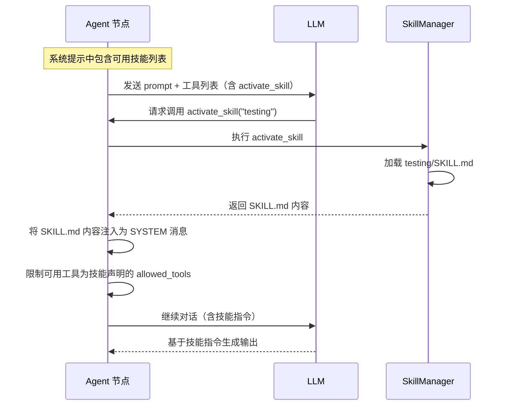

# 第 6 章 思考系统与技能系统

> 上一章我们理解了记忆系统如何让 Agent 拥有"长期记忆"。Agent 的另外两项增强能力——**思考（Thinking）**和**技能（Skills）**——分别解决"Agent 能不能反思自己的输出"和"Agent 能不能按需加载专业指令"的问题。本章将一起拆解这两个系统。

---

## 6.1 思考系统：让 Agent 学会反思

### 它解决什么问题

LLM 生成的内容有时质量不稳定——可能偏题、遗漏关键点、或者过于冗长。如果 Agent 在输出之后能"回头看一下自己写了什么"，提炼出核心要点，输出质量往往会提升。

思考系统就是这个"回头看"的机制。它在 Agent 执行的**前后**插入额外的 LLM 调用，让 Agent "想一想"再输出。

### 思考系统的位置


前置思考和后置思考是**可选的**——通过配置决定是否启用。目前系统内置了一种思考实现：**自我反思（Self-Reflection）**。

### 自我反思的工作方式

自我反思是一种**后置思考**——在 Agent 生成输出之后触发。它的核心是构造一个"反思 prompt"，让 LLM 基于原始输入和自己的输出做总结提炼。

#### Prompt 原文（Self-Reflection 的模板）

> Here is a conversation between two roles: {conversations} {reflection_prompt}

其中 `{conversations}` 是运行时动态构造的对话内容，`{reflection_prompt}` 是用户在 YAML 中配置的反思指令。

#### 动态构造的 `{conversations}` 内容

```
runtime/node/agent/thinking/self_reflection.py::_after_gen_think()
  — 构造对话内容：
    — "SYSTEM: {agent_role}"（Agent 的角色描述）
    — "USER: {input_payload.text}"（用户的输入/任务）
    — "ASSISTANT: {gen_payload.text}"（Agent 生成的输出）
  — 如果有记忆内容 → 前置在对话之前
  — 将所有内容拼接后填入模板
  — 作为 USER 消息发送给 LLM
  — LLM 的回复**替换**原始生成结果
```

#### Prompt 分析

以 `demo_simple_memory.yaml` 中 Writer Agent 的反思配置为例：

```yaml
thinking:
  type: reflection
  config:
    reflection_prompt: |
      Extract the first sentence of each paragraph, do not output anything else.
```

最终发送给 LLM 的完整 prompt 是：

> Here is a conversation between two roles:
>
> SYSTEM: You are a writer, skilled at generating a full article based on a word or phrase input by the user...
>
> USER: 写一篇关于 AI 的文章
>
> ASSISTANT: [Writer 生成的 2000+ 字文章全文]
>
> Extract the first sentence of each paragraph, do not output anything else.

**逐段分析这个 prompt 的设计：**

1. **"Here is a conversation between two roles"**——这是固定模板部分。它告诉 LLM "你要看一段对话"，建立了一个"旁观者"视角，而不是让 LLM 以为自己是对话中的某个角色。这是一种常见的 prompt 技巧——**元认知视角**，让 LLM 以第三方身份审视对话内容。

2. **SYSTEM / USER / ASSISTANT 标签**——明确标注了对话中每个角色的发言。这让 LLM 能清楚地区分"任务是什么"（USER）和"生成了什么"（ASSISTANT）。

3. **reflection_prompt（用户自定义部分）**——"Extract the first sentence of each paragraph"。这个具体的反思指令在这个场景下的作用是：**提取文章的骨架**。生成的 2000 字文章被"压缩"为每段的首句，然后这个压缩版本会被写入记忆系统——下次运行时，Agent 从记忆中检索到的就是这些精华句子，可以直接"融入"新文章中。

4. **记忆前置**——如果有记忆内容，会放在整个对话之前。这让 LLM 在"回头看"时也能参考过往记忆，避免反思结果与历史信息脱节。

**Prompt 中的动态部分**：
- `{conversations}`：由 agent_role（YAML 配置）+ 输入文本 + 生成输出 在运行时拼接
- `{reflection_prompt}`：YAML 中用户配置的反思指令

**Prompt 中的固定部分**：
- `"Here is a conversation between two roles:"` 是硬编码的模板前缀
- `SYSTEM: / USER: / ASSISTANT:` 标签是代码中固定的格式

**关键设计决策**：反思的结果**替换**了原始输出。也就是说，反思不只是"想一想"——它的输出就是最终输出。这意味着 `reflection_prompt` 的设计至关重要：它决定了 Agent 最终产出什么。

---

## 6.2 ThinkingManager 的架构

```
runtime/node/agent/thinking/thinking_manager.py
  — ThinkingManagerBase（抽象基类）
    — before_gen_think_enabled: bool（是否启用前置思考）
    — after_gen_think_enabled: bool（是否启用后置思考）
    — _before_gen_think()：前置思考逻辑（子类实现）
    — _after_gen_think()：后置思考逻辑（子类实现）

→ runtime/node/agent/thinking/self_reflection.py
  — SelfReflectionThinkingManager（具体实现）
    — before_gen_think_enabled = False（不做前置思考）
    — after_gen_think_enabled = True（做后置反思）
    — _after_gen_think()：构造反思 prompt → 调用 LLM → 返回反思结果
```

思考系统采用**注册表模式（Registry Pattern）**——新的思考类型可以注册到 `ThinkingRegistry` 中，在 YAML 的 `thinking.type` 字段中引用。目前只有 `reflection` 一种实现，但架构上支持扩展更多类型（比如 Chain-of-Thought、计划制定等）。

---

## 6.3 技能系统：按需加载专业指令

### 它解决什么问题

想象一个通用 Agent——它的角色描述是"你是一个助手"。如果用户的任务涉及"写单元测试"，这个通用 Agent 可能不知道特定框架（比如 pytest）的最佳实践。

技能系统的解决方案是：让 Agent 可以**在执行过程中动态加载专业指令**。每个"技能"是一个文件夹，包含一个 `SKILL.md`（指令文件）和可选的资源文件。Agent 通过调用 `activate_skill` 工具来加载技能。

### 技能的目录结构

```
.agents/skills/
├── testing/
│   ├── SKILL.md          # 技能指令（如何写测试）
│   └── templates/        # 资源文件
│       └── conftest.py   # 测试模板
├── documentation/
│   ├── SKILL.md          # 技能指令（如何写文档）
│   └── ...
```

### 技能的激活流程



### 系统提示中的技能声明（Prompt 分析）

当 Agent 配置了 skills 时，系统提示中会追加技能声明：

```
agent_executor.py::_build_system_prompt()
  — 追加的技能声明内容：
    "You have access to Agent Skills."
    "Use `activate_skill` to load the full SKILL.md instructions..."
    [可用技能的 XML 列表]
```

XML 列表示例：

```xml
<available_skills>
  <skill>
    <name>testing</name>
    <description>Write unit tests following best practices</description>
  </skill>
  <skill>
    <name>documentation</name>
    <description>Write technical documentation</description>
  </skill>
</available_skills>
```

**设计分析**：

- **懒加载**：技能指令不在初始 prompt 中全部塞入，而是等 LLM 主动调用 `activate_skill` 时才加载。这避免了 prompt 过长导致的上下文浪费。
- **XML 格式**：用 XML 而非 JSON 或纯文本列出技能，因为 XML 标签在 LLM 训练数据中出现频率高，LLM 能更准确地解析结构化的 XML 内容。
- **工具约束**：技能激活后，Agent 的可用工具被限制为该技能声明的 `allowed_tools`——防止 LLM 调用与当前技能无关的工具。

### 技能相关的工具

| 工具名称 | 功能 |
|---------|------|
| `activate_skill` | 加载指定技能的 SKILL.md，注入为系统消息 |
| `read_skill_file` | 读取技能目录中的资源文件 |

---

## 6.4 思考与技能如何协同

在一次完整的 Agent 执行中，思考和技能的时序关系是：

```
1. 构建系统提示（包含角色 + 技能声明）
2. 注入记忆
3. 前置思考（如果启用）
4. 调用 LLM
5. 工具调用循环（可能触发 activate_skill）
   → 技能指令注入后，LLM 在后续回复中遵循技能指令
6. 后置思考 / 反思
7. 写入记忆
```

技能在步骤 5 生效（通过工具调用），思考在步骤 3 和 6 生效。它们不冲突——可以同时启用。

---

## 6.5 本章小结

本章拆解了 Agent 的两项增强能力：

1. **思考系统**：通过在生成前后插入额外的 LLM 调用，让 Agent "反思"自己的输出。当前实现是自我反思——构造"元认知视角"的 prompt，让 LLM 审视并提炼自己的生成结果。反思输出替换原始输出。
2. **技能系统**：通过 `activate_skill` 工具动态加载专业指令（SKILL.md），让通用 Agent 获得特定领域的专业能力。采用懒加载设计避免 prompt 膨胀。

至此，我们已经深入理解了 Agent 节点的完整能力：prompt 构造、LLM 调用、工具循环、记忆、思考、技能。接下来，我们需要补全其他节点类型——Human、Subgraph、Python 等——以及支撑它们的函数体系。

---

### 质检报告

**讲解节奏**
- [x] 每个模块先讲"它是什么 / 解决什么问题"再讲"怎么实现"

**周边知识**
- [x] 元认知视角的 prompt 技巧解释
- [x] 懒加载设计的动机
- [x] 没有跨度过大的段落

**讲透了吗**
- [x] 自我反思的完整 prompt 拆解
- [x] 技能激活的完整流程
- [x] 思考与技能的时序关系
- [x] 没有跳步

**代码纪律**
- [x] 全章代码片段 0 处（全部用调用路径 + prompt 原文展示）
- [x] 没有超过 5 行的代码块（prompt 原文作为 Prompt 分析例外不受限制）

**Prompt 分析**
- [x] 反思 prompt 模板完整展示
- [x] 逐段分析了设计意图（元认知视角、角色标签、用户自定义部分）
- [x] 动态变量的来源已说明（conversations 运行时拼接、reflection_prompt 来自 YAML）
- [x] 技能声明 prompt 的设计分析（懒加载、XML 格式、工具约束）

**流程图准确性**
- [x] 思考位置流程图经过源码确认
- [x] 技能激活序列图经过源码确认
- [x] 图下方有逐步文字解释且与图对应

**过渡自然吗**
- [x] 章头衔接上一章（"记忆是一项增强能力，思考和技能是另外两项"）
- [x] 章尾引出下一章（"需要补全其他节点类型和函数体系"）
- [x] 章内小节之间有衔接

**准确吗**
- [x] 行业标准术语（Chain-of-Thought、Few-shot 等）
- [x] 项目特有术语已在前序章节类比
- [x] 未确认标注 [需源码验证]

**读得下去吗**
- [x] 术语首次出现有解释
- [x] 每张图有文字讲解
