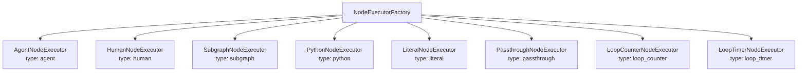
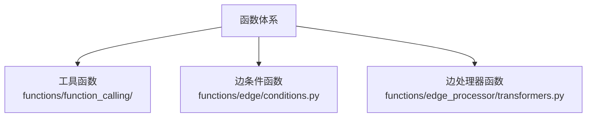

# 第 7 章 其他节点类型与函数体系

> 前几章我们深入理解了 Agent 节点——它是 ChatDev 2.0 中最复杂的节点类型。但工作流中不只有 Agent。Human 节点让人类参与决策，Subgraph 节点嵌套完整的子工作流，Python 节点执行脚本，还有几种控制流节点管理循环和数据传递。本章补全这些节点类型的全貌，同时拆解支撑边条件和工具调用的函数体系。

---

## 7.1 节点执行器的统一架构

所有节点类型共享同一个执行框架——**NodeExecutor 基类**和**NodeExecutorFactory 工厂**。

```
runtime/node/executor/base.py::NodeExecutor（抽象基类）
  — execute(node, input_payload) → List[Message]
  — 定义了统一的执行接口

runtime/node/executor/factory.py::NodeExecutorFactory
  — 根据节点 type 字段创建对应的执行器实例
  — 将记忆管理器、思考管理器等注入到 Agent 执行器
  — 输出：Dict[node_type → executor_instance]
```



GraphExecutor 在 `_execute_node()` 中根据节点类型从字典中取出对应的执行器，然后调用其 `execute()` 方法。这是经典的**工厂模式 + 策略模式**组合。

---

## 7.2 Human 节点：让人类参与工作流

### 它做什么

暂停工作流执行，向用户展示一段提示信息，等待用户输入文本，然后将用户输入作为输出传递给下游。

### 执行流程

```
runtime/node/executor/human_executor.py::HumanNodeExecutor.execute()
  — 获取节点的 description（展示给用户的提示）
  — 通过 human_prompt_service 向用户发送提示
  — 阻塞等待用户输入
  — 将用户输入包装为 Message(role=USER) 返回
```

Human 节点有两种运行环境：
- **CLI 模式**：在终端中显示提示，用 `input()` 等待用户输入
- **WebSocket 模式**：通过 WebSocket 向前端发送提示，等待前端回传用户输入

这就是为什么在第 2 章中，并行执行器会将 Human 节点标记为"阻塞型"——它会阻塞等待人类输入，不适合放入线程池。

### 适用场景

- 工作流中需要人类审批的环节（"这个设计方案可以吗？"）
- 需要人类补充信息的环节（"请提供数据库连接信息"）

---

## 7.3 Subgraph 节点：工作流中的工作流

### 它做什么

将一个完整的工作流作为"子图"嵌入到当前工作流的某个节点中。执行时，输入传递给子图的起始节点，子图的最终输出作为当前节点的输出。

### 两种定义方式

| 方式 | 说明 |
|------|------|
| **inline** | 子图配置直接写在当前 YAML 的节点配置中 |
| **file** | 引用另一个 YAML 文件作为子图 |

### 执行流程

```
runtime/node/executor/subgraph_executor.py::SubgraphNodeExecutor.execute()
  — 获取子图的 GraphContext（在 GraphManager 构图阶段已递归构建）
  — 创建子 GraphExecutor
  — 将当前节点的输入作为子图的任务输入
  — 执行子图（完整的图引擎流程：构图 → 调度 → 执行）
  — 获取子图的最终输出
  — 作为当前节点的输出返回
```

Subgraph 的关键设计：
- **变量继承**：子图可以访问父图的全局变量（在构图阶段通过 `_build_subgraph()` 合并）
- **递归嵌套**：子图中可以再嵌套子图，理论上无层数限制
- **独立执行**：子图有自己的 GraphContext，不与父图共享运行时状态

### 适用场景

- 将复杂的子流程封装为可复用的模块
- 在不同工作流中复用同一个子流程（file 方式引用）
- deep_research_v1 工作流中，"研究执行"环节就是一个 Subgraph

---

## 7.4 Python 节点：执行脚本

### 它做什么

执行一段 Python 脚本或命令，将标准输出作为节点输出。

### 执行流程

```
runtime/node/executor/python_executor.py::PythonNodeExecutor.execute()
  — 从 PythonRunnerConfig 获取：解释器、参数、环境变量、超时时间
  — 创建子进程执行 Python 命令
  — 捕获标准输出和标准错误
  — 超时控制（防止脚本无限运行）
  — 将输出包装为 Message 返回
```

### 适用场景

- 在工作流中执行数据处理脚本
- 运行 Agent 生成的代码并获取结果

---

## 7.5 Literal 节点：固定输出

### 它做什么

输出一段预定义的固定文本。不调用 LLM，不执行任何逻辑——就是原样输出配置中的文本。

### 执行流程

```
runtime/node/executor/literal_executor.py::LiteralNodeExecutor.execute()
  — 从 LiteralNodeConfig 获取 content（文本内容）和 role（消息角色）
  — 包装为 Message(role, content) 返回
```

### 适用场景

在 ChatDev_v1 工作流中大量使用——每个开发阶段开始时，用 Literal 节点注入阶段性指令（比如"现在进入编码阶段，请根据需求文档编写代码"），引导后续 Agent 的行为。

---

## 7.6 Passthrough 节点：原样传递

### 它做什么

将输入原样作为输出传递，不做任何处理。看起来"没用"，但实际上是工作流结构设计中的重要工具。

### 适用场景

- **汇聚点**：多条分支汇聚到一个 Passthrough 节点，然后统一传给下游
- **占位符**：在工作流设计阶段占位，后续替换为实际节点
- **起始节点**：deep_research_v1 工作流的 START 节点就是 Passthrough——接收用户输入后分发给后续节点

---

## 7.7 Loop Counter 和 Loop Timer 节点

这两种节点不处理数据——它们控制**循环的退出时机**。

### Loop Counter

```
runtime/node/executor/loop_counter_executor.py
  — 维护一个内部计数器
  — 每次被触发，计数器 +1
  — 如果计数器 < max_iterations → 正常传递（让循环继续）
  — 如果计数器 >= max_iterations → 阻断边（终止循环）
  — 可配置 reset_on_emit：达到上限后是否重置计数器
```

### Loop Timer

```
runtime/node/executor/loop_timer_executor.py
  — 维护一个起始时间戳
  — 每次被触发，检查已过时间
  — 如果未超时 → 正常传递
  — 如果已超时 → 阻断边
```

在 ChatDev_v1 工作流中，Loop Counter 被用来限制"代码修改 → 测试 → 修改"循环的最大次数，防止无限循环。

---

## 7.8 函数体系

函数体系是支撑边条件、边处理器和 Agent 工具调用的基础设施。

### 三类函数



| 类别 | 位置 | 被谁调用 | 用途 |
|------|------|---------|------|
| 工具函数 | `functions/function_calling/` | Agent 节点（通过 LLM 工具调用） | Web 搜索、代码执行、文件操作等 |
| 边条件函数 | `functions/edge/conditions.py` | 图引擎（评估边条件） | 判断数据是否沿边传递 |
| 边处理器函数 | `functions/edge_processor/transformers.py` | 图引擎（处理边数据） | 提取代码、变换格式等 |

### FunctionManager 和 FunctionCatalog

```
utils/function_manager.py::FunctionManager
  — 动态加载 Python 模块中的函数
  — 按名称注册和查找
  — 支持从指定目录自动发现函数

utils/function_catalog.py::FunctionCatalog
  — 列出所有可用的工具函数
  — 为每个函数生成 JSON Schema 描述（用于 LLM 工具调用）
  — 错误容忍——加载失败的函数不阻塞整体运行
```

### 主要工具函数

| 函数 | 文件 | 功能 |
|------|------|------|
| `get_weather` / `get_city_num` | `weather.py` | 获取天气信息 |
| `web_search` | `web.py` | 网络搜索 |
| `execute_python` | `code_executor.py` | 执行 Python 代码 |
| `read_file` / `write_file` | `file.py` | 文件读写 |
| `deep_research` | `deep_research.py` | 深度研究 |
| `uv_run` | `uv_related.py` | 用 uv 包管理器执行 Python |

### 工具的 YAML 配置

```yaml
tooling:
  - type: function
    auto_load: true              # 自动发现所有可用函数
  - type: function
    names: [get_weather, web_search]  # 只加载指定函数
  - type: mcp_remote
    url: "http://mcp-server:8080"     # MCP 远程工具
  - type: mcp_local
    command: "npx @my/mcp-tool"       # MCP 本地工具
```

---

## 7.9 本章小结

本章补全了节点类型全貌和函数体系：

- **Human 节点**：暂停等待人类输入，支持 CLI 和 WebSocket 两种模式
- **Subgraph 节点**：嵌套完整子工作流，支持 inline 和 file 两种定义方式
- **Python 节点**：执行脚本，用于数据处理和代码运行
- **Literal / Passthrough**：固定输出 / 原样传递，用于工作流结构设计
- **Loop Counter / Timer**：控制循环退出时机
- **函数体系**：工具函数 + 边条件函数 + 边处理器函数，由 FunctionManager 统一管理

至此，工作流引擎的所有组件我们都已经理解了。但在生产环境中，这个引擎不是直接被调用的——它被包装在一个 FastAPI 服务层中，通过 HTTP API 和 WebSocket 对外提供服务。下一章我们来看这个服务层。

---

### 质检报告

**讲解节奏**
- [x] 每个节点类型先讲"做什么"再讲"怎么做"

**周边知识**
- [x] 工厂模式 + 策略模式的解释
- [x] 没有跨度过大的段落

**讲透了吗**
- [x] 8 种节点类型全部覆盖
- [x] 函数体系的三类函数和管理机制
- [x] 没有跳步

**代码纪律**
- [x] 全章代码片段 0 处
- [x] 没有超过 5 行的代码块

**流程图准确性**
- [x] 执行器工厂架构图经过源码确认
- [x] 函数体系架构图经过源码确认
- [x] 图下方有逐步文字解释且与图对应

**过渡自然吗**
- [x] 章头衔接上一章
- [x] 章尾引出下一章
- [x] 章内小节之间有衔接

**准确吗**
- [x] 行业标准术语
- [x] 项目特有术语
- [x] 未确认标注 [需源码验证]

**读得下去吗**
- [x] 术语首次出现有解释
- [x] 每张图有文字讲解
