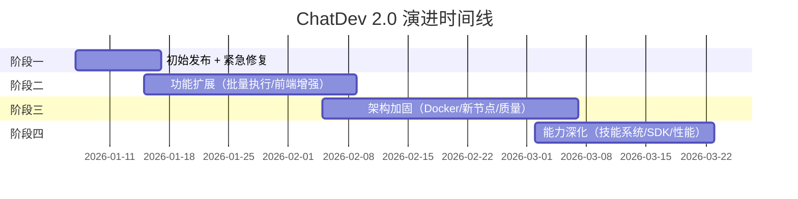
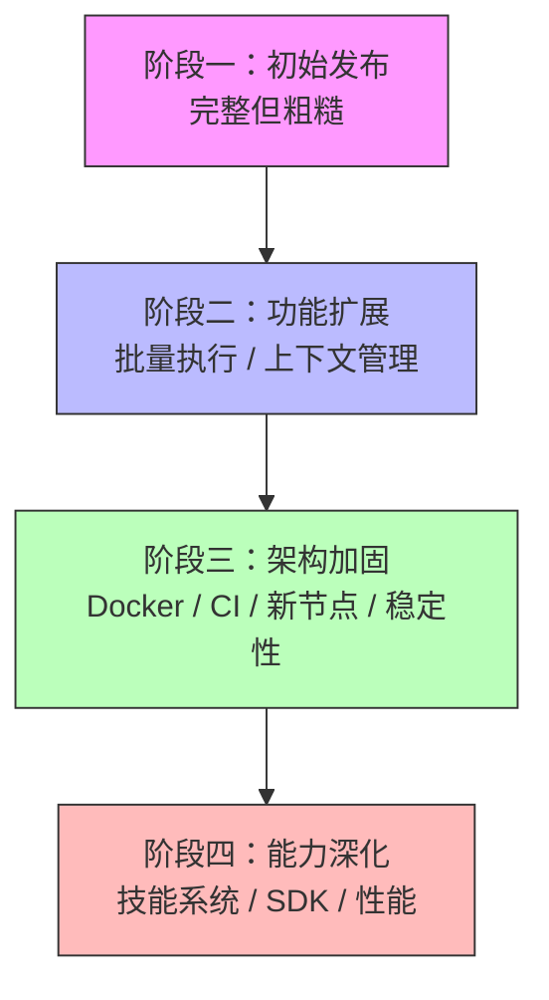

# 第 9 章 项目演进史

> 前面八章我们从"静态"视角理解了 ChatDev 2.0 的架构和实现。本章换一个视角——通过 commit 历史，看这个项目是怎么从最初的形态**"长"**成现在这样的。理解演进过程，能帮助你明白"为什么是这个架构"而非"为什么不是另一个"。

---

## 9.1 总览：163 个 commits，75 天

ChatDev 2.0 的 commit 历史从 2026 年 1 月 7 日到 3 月 22 日，共 163 个 commits，跨度约 75 天。我们可以将其划分为四个阶段：



---

## 9.2 阶段一：初始发布与紧急修复（1 月 7 日 — 1 月 14 日）

### 当时的架构

2026 年 1 月 7 日，ChatDev 2.0 以"initial commit of chatdev 2.0"发布。这个初始版本已经包含了我们在前面章节看到的核心架构：

- YAML 配置驱动的图引擎
- Agent / Human / Subgraph / Python 等节点类型
- 边条件和处理器
- OpenAI 和 Gemini Provider
- FastAPI 后端 + Vue 3 前端
- 记忆系统和思考系统

这说明 ChatDev 2.0 是一个经过较长时间内部开发后的**一次性发布**，而不是从零开始的公开开发。

### 遇到的问题

发布后立即暴露了多个问题：

1. **前端聊天界面不工作**（1 月 8 日，4 个连续 fix commits）——"support chat interface"
2. **OpenAI 函数调用 API 错误**（1 月 9 日）——chat.completions.create 的函数调用参数格式不对
3. **旧版 ChatDev 链接断裂**（1 月 9 日）——分支迁移后的历史链接失效
4. **动态配置错误**（1 月 8 日）——teach_video 场景的动态配置解析问题

### 做了什么

密集的 bugfix——发布后的一周内有 10+ 个修复 commits。这是一个典型的"发布后稳定期"。

---

## 9.3 阶段二：功能扩展（1 月 15 日 — 2 月 5 日）

### 架构变化

在核心架构稳定后，项目开始横向扩展功能。

**批量执行**（1 月 10 日 — 1 月 15 日）：

这是一个重要的功能添加——从"一次执行一个任务"到"一次执行多个任务"。它涉及：
- 新增 `server/routes/batch.py` 批量执行 API
- 新增 `server/services/batch_run_service.py` 批量执行服务
- 前端添加 `BatchRunView.vue` 批量执行界面
- 前端添加"settings modal for batch processing"配置面板

**上下文窗口管理**（1 月 10 日）：

添加了 `context_window` 配置——控制每个节点保留多少历史消息。这解决了长对话场景下 LLM 上下文溢出的问题。

**Gemini Provider 增强**（1 月 16 日）：

修复并行图片生成错误，添加图片比例设置。说明用户已经开始在实际场景中使用 Gemini 做多模态任务。

**JSON/JSONL 文件支持**（1 月 12 日）：

修复 OpenAI Provider 加载 JSON/JSONL 文件的错误。这是用户实际使用中发现的——Agent 需要处理数据文件。

### 这个阶段的特征

以"用户反馈驱动"为主——修复实际使用中发现的问题，补充实际场景需要的功能（批量、上下文管理、文件格式支持）。

---

## 9.4 阶段三：架构加固（2 月 5 日 — 3 月 2 日）

### 架构变化

这个阶段的主题是"让系统更健壮、更容易部署、更容易使用"。

**Docker 支持**（2 月 6 日 — 2 月 10 日）：

```
2026-02-06: add: Docker support with multi-stage build and Compose
2026-02-07: fix: resolve runtime issues in Docker environment
2026-02-09: update: remove production-like settings from Docker to focus on local use
2026-02-09: fix: removed duplicate CORS middleware
```

Docker 支持的添加过程很有意思——从首次提交到稳定经历了 4 个 commits。最初的 Docker 配置包含了一些"生产环境"设置，但后来被回退为"聚焦本地使用"——说明项目团队意识到过早优化部署配置会增加用户上手难度。

**Loop Timer 节点**（2 月 7 日 — 2 月 12 日）：

新增 `loop_timer` 节点类型——基于时间而非计数来控制循环退出。这是对循环控制能力的补充，由社区贡献者 LaansDole 提交。

**前端 UX 增强**（2 月 8 日 — 2 月 10 日）：

密集的前端改进：
- 富 Tooltip 组件（帮助用户理解节点配置）
- 节点帮助内容
- Tutorial View 中的滚动到内容功能
- Dashboard/Terminal 切换

**YAML 校验 CI**（2 月 7 日）：

添加 GitHub Actions 工作流来自动校验所有 YAML 文件。这说明 YAML 配置的质量开始成为关注点——41 个示例工作流需要保证始终可用。

**WebSocket 稳定性**（2 月 5 日）：

修复 WebSocket 断开问题。这是生产使用中常见的问题——长时间执行的工作流需要稳定的 WebSocket 连接。

**记忆系统修复**（3 月 15 日）：

"fix: stored memory embeddings had mixed dim"——修复存储的 Embedding 向量维度不一致问题。这是一个微妙的 bug——不同的 Embedding 模型可能返回不同维度的向量，混在一起会导致 FAISS 检索失败。

### 这个阶段的特征

从"能用"到"好用"——Docker 部署、前端 UX 改善、CI 质量保证、稳定性修复。

---

## 9.5 阶段四：能力深化（3 月 2 日 — 3 月 22 日）

### 架构变化

**Agent Skills 系统**（3 月 2 日 — 3 月 11 日）：

```
2026-03-02: feat(agent): add filesystem-backed Agent Skills with activation and demo skills
2026-03-10: fix(skills): track current active skill explicitly and relocate to .agents/skills/
```

这是一个重要的架构扩展——从"Agent 的能力在 YAML 中固定配置"到"Agent 可以在运行时按需加载专业技能"。Skills 系统的添加经历了两个阶段：先添加核心功能，然后修复技能状态追踪和目录结构问题。

**工具管理端点**（3 月 11 日）：

添加工具列表 API（`server/routes/tools.py`）——让前端可以展示和管理可用工具。

**前端聊天面板**（3 月 14 日）：

"feat(frontend): add persistent chat panel with fullscreen toggle"——添加持久化聊天面板，让用户可以在执行过程中与工作流交互。

**性能优化**（2 月 24 日 — 2 月 27 日）：

```
2026-02-24: perf: reduce workflow graph sync overhead
2026-02-06: wip: fix front-end lag issue
```

前端卡顿问题的修复——说明随着用户增多和工作流变大，性能开始成为关注点。

**Python SDK**（3 月 21 日 — 3 月 22 日）：

"Add ChatDev Python SDK announcement to README"——宣布 Python SDK，让开发者可以编程方式调用工作流，不再局限于 CLI 和 Web 界面。这是从"零代码工具"向"开发者平台"的一步扩展。

### 这个阶段的特征

从"通用编排"到"专业能力"——技能系统让 Agent 更智能，SDK 让集成更方便，性能优化让大规模使用成为可能。

---

## 9.6 演进脉络总结



几个值得注意的演进模式：

1. **核心架构一次定型**：图引擎、节点类型、记忆系统、Provider 抽象——这些核心组件在初始发布时就已经完整。后续的 162 个 commits 几乎没有对核心架构做大的重构。这说明 2.0 在公开发布前经历了充分的内部设计和开发。

2. **社区驱动的渐进改善**：Loop Timer、Docker 支持、前端 UX 增强等功能由社区贡献者（LaansDole、zivkovicp、NINE-J 等）提交。项目采用了"接受贡献 → 合并 → 修复问题 → 更新贡献者列表"的协作模式。

3. **从"能用"到"好用"到"更强"**的三段式演进——先保证核心功能工作，再提升稳定性和体验，最后扩展高级能力。

4. **YAML 驱动的一致性**：从始至终，YAML 配置是系统的核心接口。新功能（如技能系统、循环定时器）都通过扩展 YAML schema 来暴露，保持了"零代码"的设计承诺。

---

到此，我们既理解了系统"是什么样的"（第 0-8 章），也理解了它"是怎么长成这样的"（本章）。最后一章，我们将通过三个完整的端到端场景，把前面所有章节的知识串联起来。

---

### 质检报告

**讲解节奏**
- [x] 每个阶段先讲"当时是什么样"再讲"遇到什么问题 → 做了什么"

**周边知识**
- [x] 没有跨度过大的段落

**讲透了吗**
- [x] 4 个演进阶段各有具体 commit 佐证
- [x] 关键转折点（Docker、Skills、SDK）有详细分析
- [x] 演进模式总结有洞察
- [x] 没有跳步

**代码纪律**
- [x] 全章代码片段 0 处
- [x] 没有超过 5 行的代码块

**流程图准确性**
- [x] 时间线甘特图基于实际 commit 日期
- [x] 演进脉络图与实际 commit 历史一致

**过渡自然吗**
- [x] 章头衔接上一章（"换一个视角——通过 commit 历史"）
- [x] 章尾引出下一章（"最后一章串联所有知识"）
- [x] 章内小节之间按时间线自然过渡

**准确吗**
- [x] 所有 commit 引用来自实际 git log
- [x] 日期和内容描述准确
- [x] 未确认标注 [需源码验证]

**读得下去吗**
- [x] 术语首次出现有解释
- [x] 每张图有文字讲解
