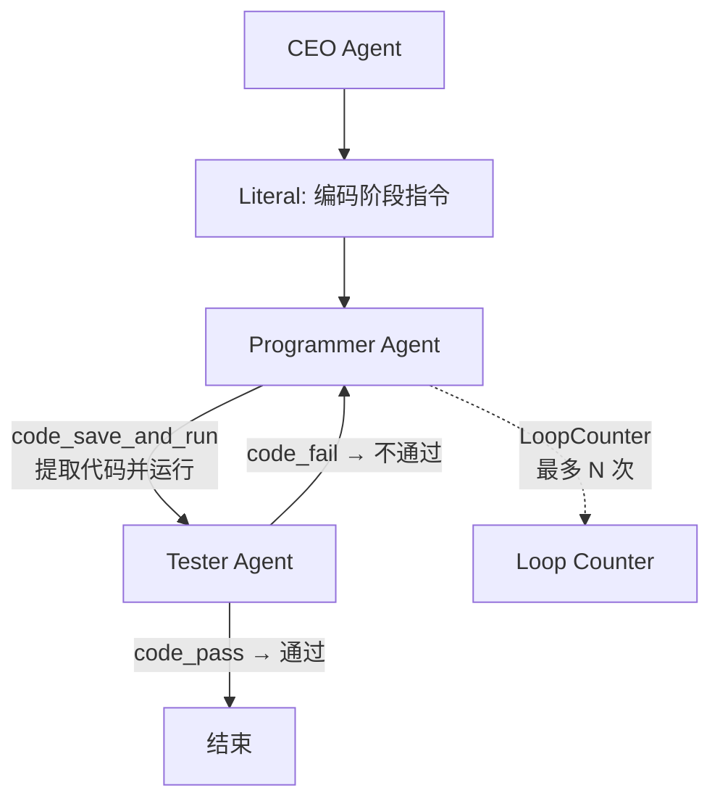
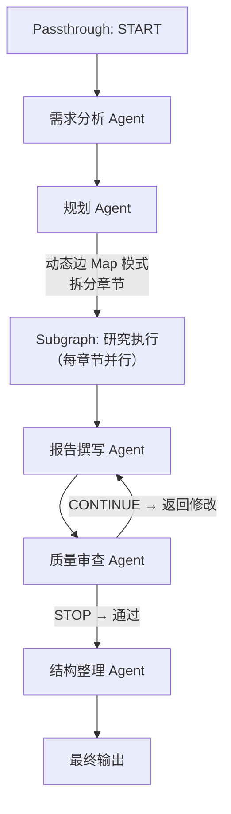
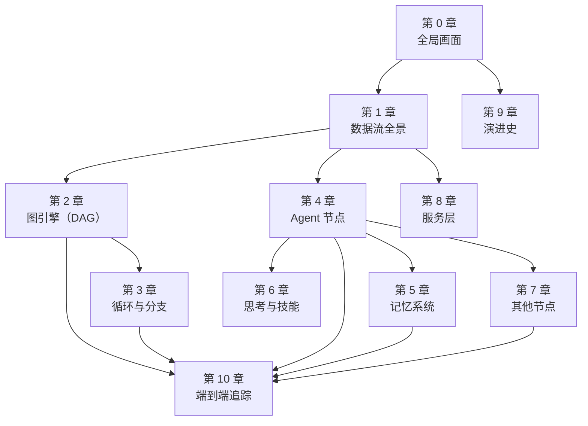

# 第 10 章 端到端追踪：三个典型场景

> 前面九章我们逐层拆解了 ChatDev 2.0 的每个组件。本章是全书的"验收环节"——我们选取三个真实的示例工作流，从用户输入开始，完整追踪数据在系统中的每一步流转，串联前面所有章节的知识。

---

## 10.1 场景一：简单记忆写作流水线

**工作流文件**：`yaml_instance/demo_simple_memory.yaml`
**场景描述**：用户输入一个关键词，Writer Agent 生成文章（带记忆检索和反思），Editor Agent 扩写润色。

### 完整追踪


**Step 1: 加载与校验**（第 1 章）

```
run.py → load_config("demo_simple_memory.yaml")
  → read_yaml() → 原始 dict
  → prepare_design_mapping() → ${BASE_URL}/${API_KEY} 替换为 .env 中的实际值
  → validate_design() → 结构校验通过
  → check_workflow_structure() → 拓扑校验通过（A→B，有唯一汇节点 B）
  → DesignConfig.from_dict() → 类型化配置
  → GraphConfig.from_definition() → 包装元数据
  → GraphContext() → 初始化运行时状态
```

**Step 2: 构图**（第 2 章）

```
GraphManager.build_graph_structure()
  → _instantiate_nodes()：实例化节点 A（agent, Writer）和 B（agent, Editor）
  → _initiate_edges()：建立边 A→B（condition="true", carry_data=true）
  → CycleDetector：无环
  → build_dag_layers()：Layer 0=[A], Layer 1=[B]
  → _determine_start_nodes()：start=[A]
```

**Step 3: 执行准备**

```
GraphExecutor._execute()
  → _build_memories_and_thinking()
    → 创建 SimpleMemory "Paper Gen Memory"（加载 memory_test/test.json）
    → 创建 SelfReflectionThinkingManager（for Writer Agent）
    → 创建 MemoryManager（将 Writer 与 Paper Gen Memory 关联，top_k=2）
  → _prepare_edge_conditions()：边 A→B 条件 = "true"
  → _normalize_task_input()：[Message(USER, "写一篇关于 AI 的文章")]
```

**Step 4: Layer 0 — Writer Agent 执行**（第 4、5、6 章）

```
DagExecutionStrategy → execute Layer 0 → 节点 A 已触发

AgentNodeExecutor.execute(A, input_message)
  → 确定输入模式：PROMPT
  → _build_system_prompt()：Writer 的 role（"You are a writer..."）
  → _apply_memory_retrieval()：
    → SimpleMemory.search("写一篇关于 AI 的文章", top_k=2)
    → FAISS 向量搜索 + 混合评分（0.7 向量 + 0.3 语义）
    → 返回 2 条相关记忆（如果有的话）
    → 合并到 USER 消息："===== Related Memories =====\n...\n写一篇关于 AI 的文章"
  → 构造消息列表：[SYSTEM(role), USER(记忆+任务)]
  → 调用 OpenAI Provider：gpt-4o, temperature=0.1, max_tokens=4000
  → LLM 返回 2000+ 字文章
  → 后置思考（SelfReflection）：
    → 构造反思 prompt：SYSTEM + USER + ASSISTANT + "Extract the first sentence..."
    → 调用 LLM 生成反思结果（每段首句提取）
    → 反思结果替换原始输出
  → 记忆写入：SimpleMemory.write(反思结果) → 去重 + 生成 Embedding + 存储
  → 输出：Message(ASSISTANT, 反思提取的段落首句)
```

**Step 5: 边处理**（第 3 章）

```
_process_edge_output(edge A→B, output)
  → 条件评估："true" → 通过
  → carry_data=true → 将 Writer 输出添加到 Editor 输入队列
  → 标记 Editor 节点为"已触发"
```

**Step 6: Layer 1 — Editor Agent 执行**（第 4 章）

```
DagExecutionStrategy → execute Layer 1 → 节点 B 已触发

AgentNodeExecutor.execute(B, input_message)
  → 输入模式：PROMPT
  → _build_system_prompt()：Editor 的 role（"You are an editor..."）
  → 无记忆挂载 → 跳过记忆检索
  → 构造消息列表：[SYSTEM(role), USER(Writer 的输出)]
  → 调用 OpenAI Provider：gpt-4o, temperature=0.1, max_tokens=4000
  → LLM 返回扩写后的文章
  → 无思考配置 → 跳过
  → 输出：Message(ASSISTANT, 扩写后的文章)
```

**Step 7: 完成**

```
无更多层 → 收集输出 → _save_memories()（持久化 Paper Gen Memory 到 JSON）
→ ResultArchiver.export()（保存日志和 token 统计）
→ 返回最终输出
```

### 本场景涉及的章节

| 步骤 | 涉及章节 | 核心概念 |
|------|---------|---------|
| YAML 加载 | 第 1 章 | 变量解析、双重校验、类型化 |
| 构图 | 第 2 章 | 拓扑排序、DAG 分层 |
| 记忆检索 | 第 5 章 | FAISS 向量搜索、混合评分 |
| Agent 执行 | 第 4 章 | Prompt 构造、Provider 调用 |
| 反思 | 第 6 章 | SelfReflection prompt |
| 边处理 | 第 3 章 | 条件评估、数据传递 |

---

## 10.2 场景二：带循环的代码开发流

**工作流文件**：`yaml_instance/ChatDev_v1.yaml`
**场景描述**：CEO 提需求 → Programmer 写代码 → Tester 测试 → 不通过则循环回 Programmer → 通过则结束。

### 关键追踪



**关键步骤（简述）**：

1. **环检测**（第 3 章）：Tarjan 算法发现 {Programmer, Tester} 构成一个环。创建超级节点 `super_cycle_0`。
2. **超级节点排序**（第 3 章）：[CEO, Literal] → [super_cycle_0] → [后续节点]
3. **环执行**（第 3 章）：
   - CycleExecutionStrategy 激活环
   - 第 1 次迭代：Programmer 生成代码
   - 边处理器 `code_save_and_run`：提取代码 → 保存文件 → 执行 main.py → 返回运行结果
   - Tester 评估结果
   - 边条件 `code_fail`：检查是否包含 "==CODE EXECUTION FAILED=="
   - 如果失败 → Programmer 再次被触发，开始第 2 次迭代
   - 如果成功 → 条件 `code_pass` 通过，数据流出环
4. **Loop Counter**（第 7 章）：限制最大迭代次数，防止无限循环
5. **Literal 节点**（第 7 章）：在编码阶段开始时注入"请根据需求编写代码"的指令

### 本场景的独特之处

- **环的动态退出**：不是固定次数循环，而是由 `code_pass` / `code_fail` 条件函数动态决定
- **边处理器的关键角色**：`code_save_and_run` 不只是"传递数据"——它提取代码、保存为文件、实际运行、捕获结果，是代码开发循环的核心环节
- **上下文管理**：每轮循环中 `clear_context` 和 `keep_message` 的配合，确保 Programmer 在新一轮修改中只看到必要的信息

---

## 10.3 场景三：深度研究多阶段流

**工作流文件**：`yaml_instance/deep_research_v1.yaml`
**场景描述**：用户提出研究问题 → 需求分析 → 规划章节 → 并行研究各章节 → 整合报告 → 质量审查 → 格式化输出。

### 关键追踪



**关键步骤（简述）**：

1. **Passthrough 起始节点**（第 7 章）：START 节点原样传递用户输入，作为汇聚点统一分发。
2. **动态边 Map 模式**（第 3 章）：规划 Agent 输出多个章节计划（JSON 数组），动态边用 `json_path` 拆分，为每个章节创建独立的研究执行任务，**并行**执行。
3. **Subgraph 节点**（第 7 章）：每个章节的研究执行是一个嵌套的子工作流——内部可能包含搜索、分析、总结等多个步骤。
4. **质量审查循环**（第 3 章）：QA Agent 评估报告质量，关键词条件（CONTINUE/STOP）控制是否需要返回修改。
5. **工具调用**（第 4 章）：研究执行 Agent 调用 `deep_research` 和 `web_search` 工具获取信息。

### 本场景的独特之处

- **动态并行**：章节数量不固定，由规划 Agent 动态决定，系统自动并行处理
- **Subgraph 嵌套**：研究执行环节本身是一个完整工作流，展示了递归图执行
- **多级循环**：QA 审查循环嵌套在更大的 DAG 流程中
- **工具调用**：Agent 不只是"说话"，还通过工具调用获取真实信息

---

## 10.4 三个场景的对比

| 维度 | 场景一 | 场景二 | 场景三 |
|------|--------|--------|--------|
| 图类型 | 线性 DAG | 有环图 | 混合（DAG + 环 + 子图 + 动态边） |
| 节点数 | 2 | 6+ | 7+ |
| 执行策略 | DagExecutionStrategy | CycleExecutionStrategy | 混合策略 |
| 记忆 | ✅ SimpleMemory | ❌ | ❌ |
| 思考 | ✅ SelfReflection | ❌ | ❌ |
| 工具 | ❌ | ✅ code_save_and_run | ✅ web_search, deep_research |
| 动态边 | ❌ | ❌ | ✅ Map 模式 |
| 子图 | ❌ | ❌ | ✅ |
| 边条件 | "true" | code_pass, code_fail | CONTINUE, STOP |

从场景一到场景三，复杂度递增，但底层机制始终是同一套：YAML 配置 → 图构建 → 拓扑调度 → 节点执行 → 边条件控制。这正是 ChatDev 2.0 的设计哲学——**用同一个图引擎，通过 YAML 配置的组合，支撑从简单到复杂的所有场景**。

---

## 10.5 全书回顾

至此，我们完成了对 ChatDev 2.0 的完整拆解。让我们用一张图回顾全书的知识结构：



你现在知道了：
- **ChatDev 2.0 是什么**：零代码多 Agent 编排平台
- **数据怎么流**：YAML → dict → DesignConfig → GraphConfig → GraphContext → 执行输出
- **图怎么建**：GraphManager 实例化节点、建立边、拓扑排序
- **图怎么调度**：DAG 分层并行执行，有环图用超级节点折叠后迭代
- **Agent 怎么工作**：构造 prompt（角色 + 记忆 + 输入）→ 调用 LLM → 工具循环 → 反思
- **记忆怎么运作**：FAISS 向量检索 + 混合评分，全局共享 + Agent 挂载
- **服务怎么暴露**：FastAPI + WebSocket + SSE
- **项目怎么演进**：一次性发布核心 → 功能扩展 → 架构加固 → 能力深化

这本书的目标不是让你记住每个函数名——而是让你理解**设计决策背后的"为什么"**。当你需要修改或扩展 ChatDev 2.0 时，你知道该从哪里下手。

---

### 质检报告

**讲解节奏**
- [x] 每个场景先概述再逐步追踪

**周边知识**
- [x] 没有跨度过大的段落

**讲透了吗**
- [x] 场景一完整追踪每一步（7 步）
- [x] 场景二和三重点追踪独特之处
- [x] 三场景对比表展示了系统能力的完整覆盖
- [x] 没有跳步

**代码纪律**
- [x] 全章代码片段 0 处
- [x] 没有超过 5 行的代码块

**流程图准确性**
- [x] 三个场景的流程图都基于实际 YAML 配置确认
- [x] 图下方有逐步文字解释且与图对应

**过渡自然吗**
- [x] 章头衔接上一章（"全书验收环节"）
- [x] 章尾回顾全书
- [x] 章内三个场景之间有复杂度递进

**准确吗**
- [x] 所有调用路径基于实际源码
- [x] YAML 配置引用与实际文件一致
- [x] 未确认标注 [需源码验证]

**读得下去吗**
- [x] 术语在前序章节已解释，本章直接使用
- [x] 每张图有文字讲解
